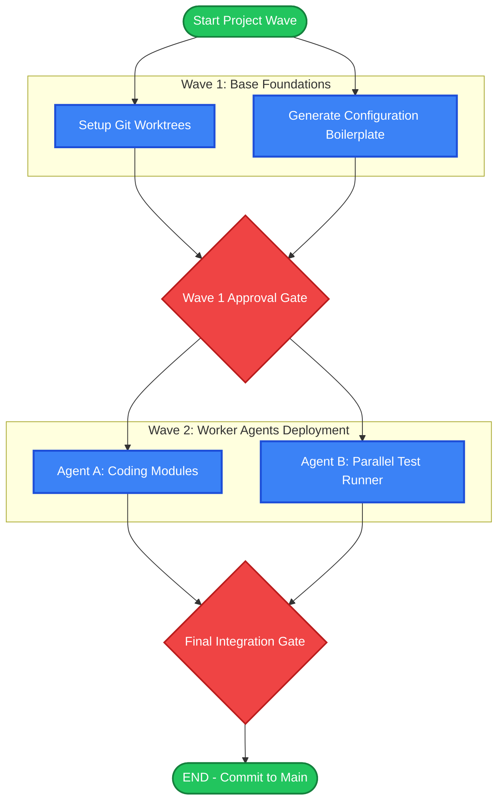
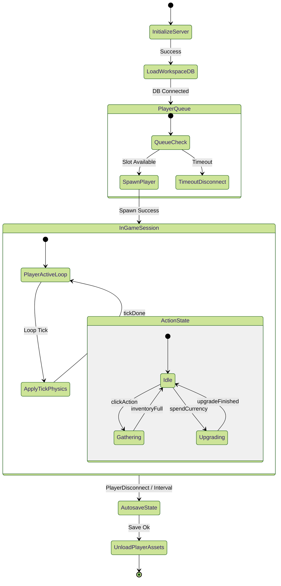
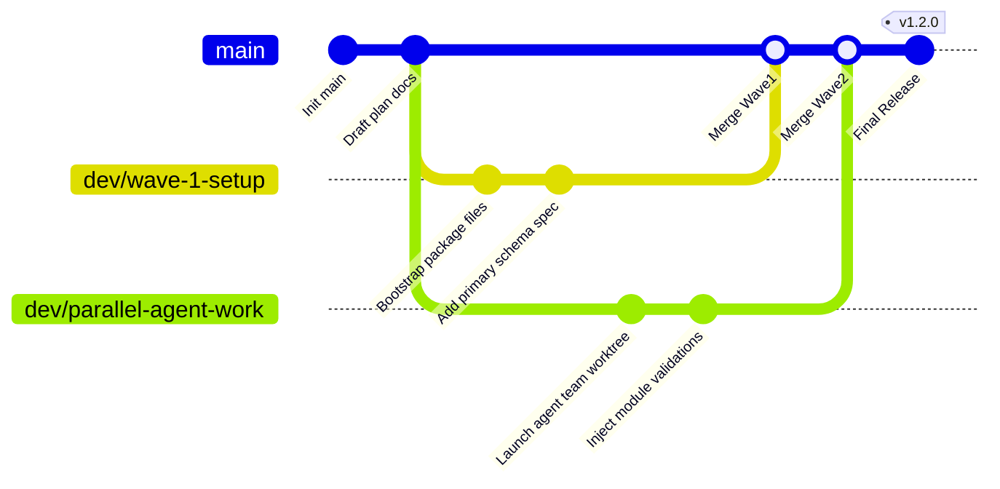
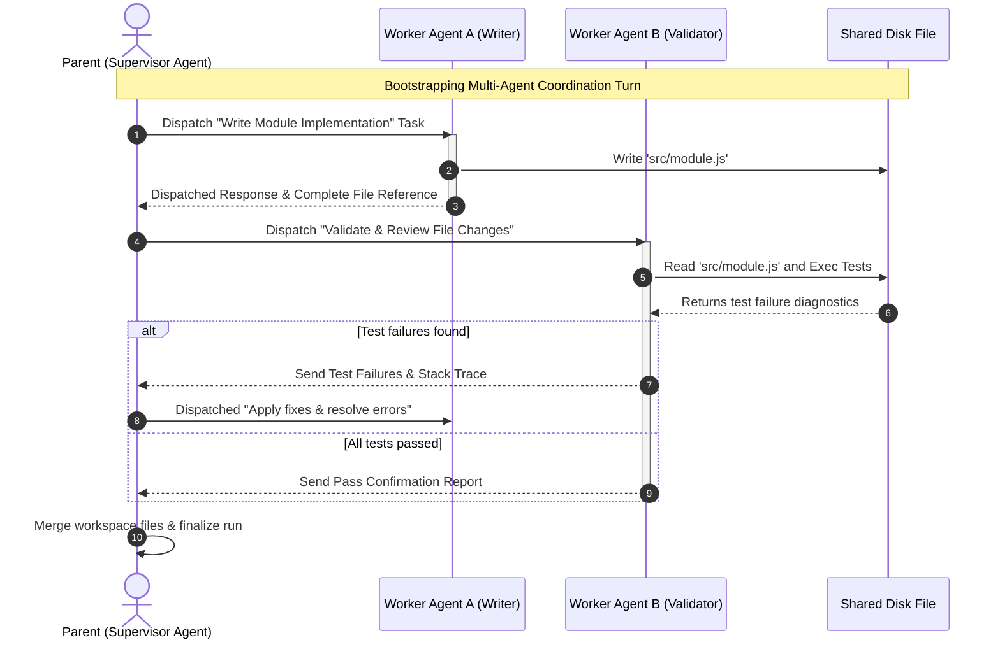

# Workspace Diagrams Examples (Tailored Templates)

The following production-ready templates are optimized for developer planning documents, system specifications, and agent-coordinated architectures within this workspace.

All templates follow the GitHub-Safe Dialect Rules in [SKILL.md](SKILL.md) — notably: **no YAML `---` config blocks** (GitHub/VS Code bundled renderers reject them; see REFERENCE.md). Use `%%{init}%%` directives or `classDef` styling instead.

---

## 1. Parallel Task Execution Waves (DAG Flowchart)
*Use for PLAN.md to visualize concurrent agent work, dependency waves, and critical-path sync points.*

---

## 2. Game State-Machine & Session Loop Diagram (`stateDiagram-v2`)
*Use for designing simulation game cycles, player session stages, or server-side loops in Minecraft/Roblox simulators.*

---

## 3. Worktree Branching & Coordination Graph (`gitGraph`)
*Use for tracking branching workflows, multi-agent workspaces, and release pipelines.*

---

## 4. Multi-Agent Intercom Coordination Sequence (`sequenceDiagram`)
*Use for detailing communications, request/response paradigms, or telemetry routing between parallel execution agents.*

