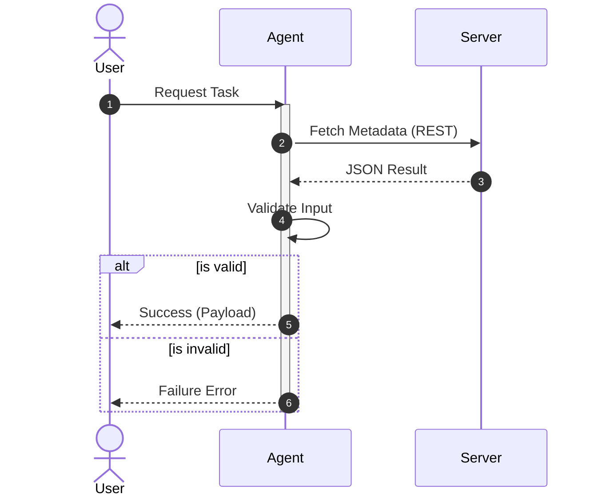
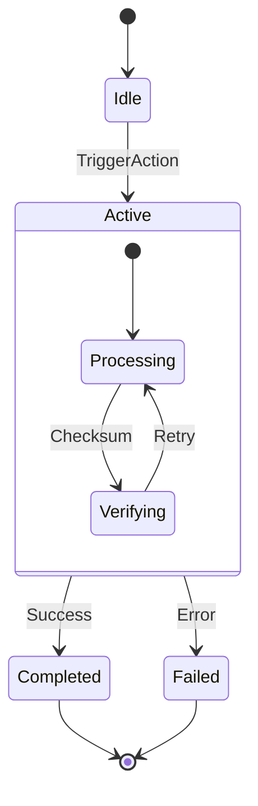
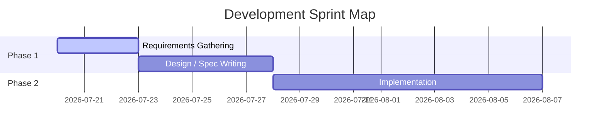
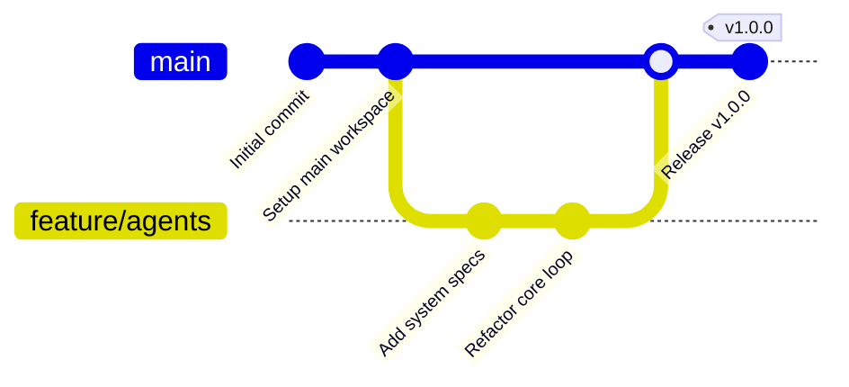
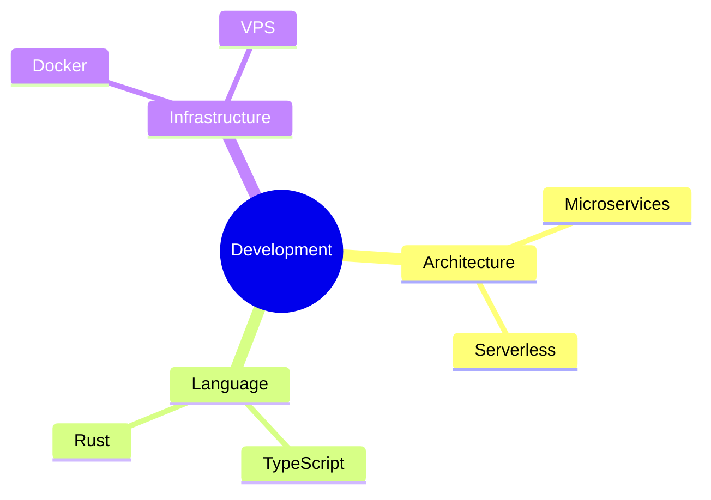
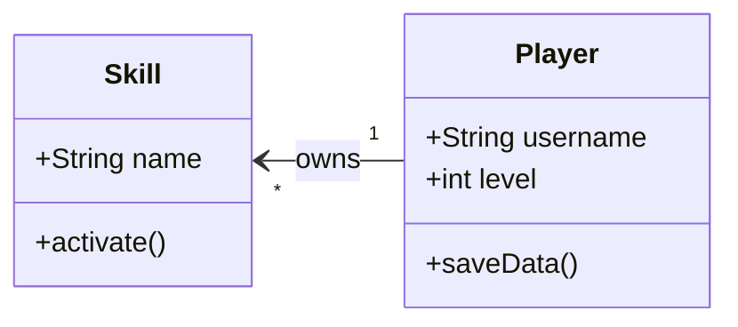
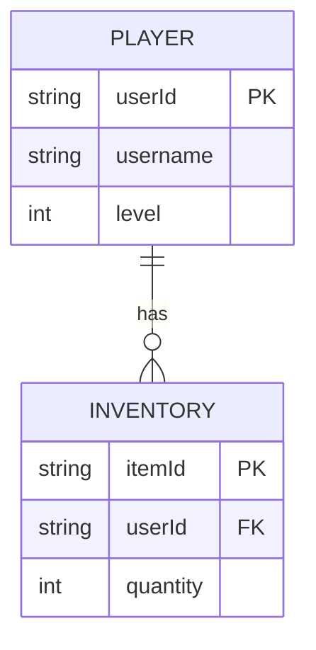
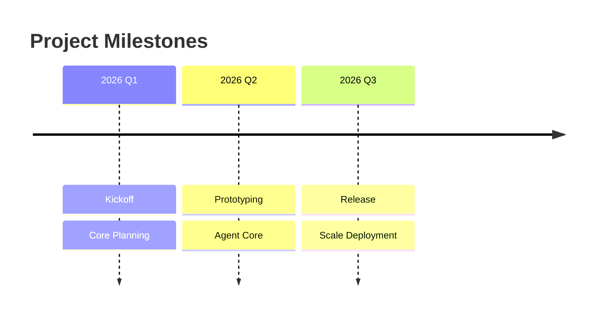
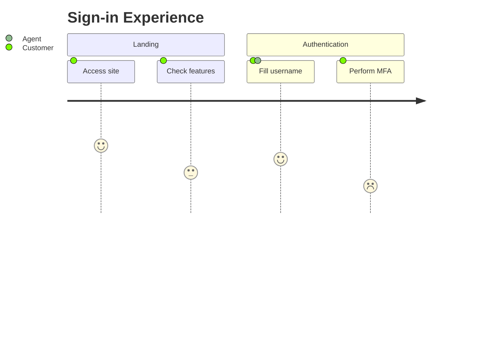

# Mermaid Diagram Types Reference

This guide provides condensed syntactic blueprints for core and secondary diagram types supported in VS Code & GitHub.

---

## Flowchart (Core DAG Engine)
```mermaid
flowchart TD
    %% Configuration — YAML frontmatter (Mermaid >= v10.8 only)
    %% GitHub and VS Code ship older renderers that do NOT support this.
    %% Fallback for broad compatibility:
    %%   %%{init: {'theme': 'base', 'themeVariables': {'primaryColor': '#2563eb'}}}%%
    %% Or skip config entirely if classDef already handles styling.
    ---
    config:
      theme: base
      themeVariables:
        primaryColor: "#2563eb"
    ---
    
    %% Node Shapes
    A(["Stadium Shape"]) --> B["Rectangle"]
    B --> C{"Decision"}
    C -- "Yes" --> D[/"Parallelogram Input"/]
    C -- "No" --> E(("Circle"))
    
    %% Multi-line and styling
    F["Line 1<br/>Line 2"]
    classDef highlight fill:#f59e0b,stroke:#d97706,stroke-width:2px;
    class A,C highlight
```

---

## Core Diagrams Catalog

### 1. Sequence Diagram (`sequenceDiagram`)


### 2. State Diagram (`stateDiagram-v2`)


### 3. Gantt Chart (`gantt`)


### 4. Git Graph (`gitGraph`)


### 5. Mind Map (`mindmap`)


---

## Lazy Diagram Reference (Secondary Types)

### Class Diagram (`classDiagram`)


### Entity-Relationship Diagram (`erDiagram`)


### Timeline (`timeline`)


### User Journey Map (`journey`)


### Quadrant Chart (`quadrantChart`)
```mermaid
quadrantChart
    title Feature Priority Map
    x-axis Low Effort --> High Effort
    y-axis Low Value --> High Value
    quadrant-1 High Value, High Effort (Plan)
    quadrant-2 High Value, Low Effort (Execute First)
    quadrant-3 Low Value, Low Effort (De-prioritise)
    quadrant-4 Low Value, High Effort (Avoid)
    "Visualiser" : [0.3, 0.8]
    "Local CI Tooling" : [0.8, 0.4]
```

### Architecture & Block Diagrams (`architecture` / `block-beta`)
```mermaid
block-beta
    columns 3
    FrontendBlock["Frontend UI"] Space FrontendDb[("Local DB")]
    block:middleGroup:3
        columns 2
        API["Backend API"]
        Cache[("Redis")]
    end
    DB[(Global Postgres)]
    FrontendBlock --> API
    API --> Cache
    API --> DB
```

### Other Standard Syntax (Quick Starters)
- **Pie Chart:** `pie title Ratio\n"Used": 75\n"Free": 25`
- **Sankey:** `sankey-beta\nSource,Target,Value\n"A","B",10`
- **XYChart:** `xychart-beta\ntitle "Speed vs Size"\nx-axis [1, 2, 3]\ny-axis "Time" [10, 20, 30]`
- **Radar:** `radar\ntitle "Capability Matrix"\nlabels [Speed, Price, Memory]\nplot1 [10, 20, 30]`
- **Treemap:** `treemap\ntitle "Disk Space"\n"Log": 200\n"Temp": 50`
- **Packet:** `packet-beta\n0-7: "Type"\n8-15: "Length"`
