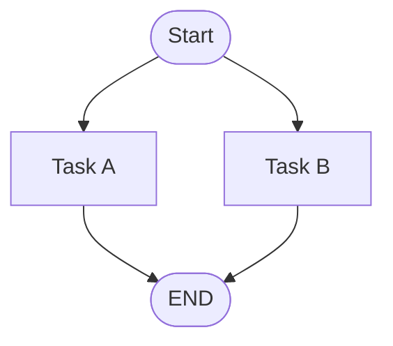

# Mermaid Diagrams

## Quick Start


## Proactive Trigger Judgment
Provide visual maps for your plans or workspace structures. Insert proactively when ANY of these hold:
1. Writing or updating a doc that needs a dependency/architecture DAG or a parallel-wave map — including `Systems Architecture.md`, system design docs, ADRs, `PLAN.md`, and Nav Guides — with $\ge 2$ intersecting parallel waves or branch operations.
2. Writing/updating ADRs highlighting complex flow variations or state machine choices.
3. **Template hand-off:** you are filling in or extending a `mermaid` block that another skill's template ships (e.g. the diagram scaffolds in `systems-architecture-builder/architecture-template.md`). The parent skill's template does NOT satisfy this skill's safety rules — always route the diagram through this skill.
4. **Emit rule:** you are about to open a ```mermaid fenced block for any reason, proactively or reactively. Pause and run the GitHub-Safe Dialect Rules checklist before writing it.
**Restraint Rule:** Do NOT diagram simple linear processes, simple 1-to-1 associations, or when a diagram already exists in the same file. Maintain a strict limit of max 1 diagram per document unless explicit split is required.

## GitHub-Safe Dialect Rules
Ensure 100% render compatibility in VS Code/GitHub markdown by strictly executing this checklist:
- [ ] **Strict Size Budget:** Max 15 nodes AND ~20 edges per diagram — edge count predicts hairball better than node count. Avoid cluttering. For larger diagrams, split into overview and zoomed-detail diagrams.
- [ ] **Tall Over Wide:** Width is the scarce resource — wide diagrams get scaled down to unreadable text in narrow editor panes/split views, while tall diagrams scroll for free. Prefer geometry that grows vertically over geometry that grows horizontally.
- [ ] **Direction by Shape:** Linear chains read best `TD`; DAGs with fan-out read best `LR` (under TD, fan-out ranks become wide rows; under LR they become tall columns that scroll free).
- [ ] **Consistent Arrow Semantics:** Pick one arrow convention, state it in one line of prose near the diagram, and keep it identical across every diagram in the doc. Recommended: `A --> B` = "B depends on A" (upstream → downstream).
- [ ] **Always Double-Quote Labels:** Declare nodes as `ID["Label text"]`. Never use backticks (\`) inside labels, as they silently fail to render on GitHub.
- [ ] **No Lowercase "end":** Never name a node or subgraph `end`. Capitalize as `End` or `END` to avoid parsing collisions.
- [ ] **Dagre Layout Only:** Rely strictly on basic flowchart flow (e.g. `flowchart TD` or `flowchart LR`). Do not use ELK directives or external layouts.
- [ ] **Quoted Special Characters:** Node labels with special characters like `()`, `&`, `:`, `<br/>` must be wrapped in double quotes. Keep edge labels plain.
- [ ] **Visual Hierarchy Palette:** Max 3–4 categorical colors (e.g. Green = Success/Start, Red = Error/Critical, Blue = Info). Match palette type to the data: ordinal/sequential categories (waves, phases, tiers) → a sequential pastel ramp with dark text (a longer ramp is fine); categorical meanings → distinct hues. Reserve gray for inactive or reference ("ghost") nodes only.

## Error Recovery Protocol
If rendering or parsing fails:
1. Feed the parse/rendering error message directly back to context.
2. Locate the specific failing syntax line (usually unquoted colon/brackets, mismatched quotes, or naming collisions).
3. Re-write the section using clean double-quoted and isolated structures.

See [REFERENCE.md](REFERENCE.md) for alternative diagram types, and [EXAMPLES.md](EXAMPLES.md) for tailored workspace templates.
