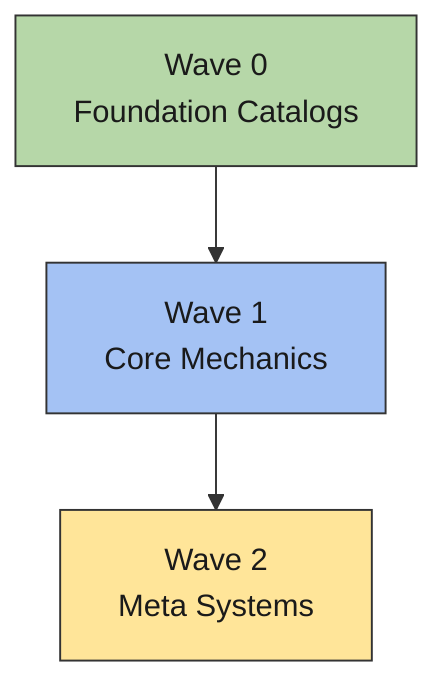
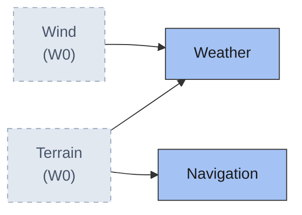

# Systems Architecture

> Canonical system index, dependency DAG, execution waves, and interface cross-reference for **<Project Name>**. System status lives **only** here — never inside individual system docs.

**How to read this doc**

- **Waves = _design order_, not runtime call order.** "System X is in wave N" means X's design can be fully defined using only systems from waves < N. Runtime integration (calling another system's API, subscribing to its events, granting its items) is **not** a design dependency — a wave-1 system may *consume* a wave-3 system's API at runtime without moving to a later wave.
- **DAG arrows point upstream → downstream:** `A --> B` means "B depends on A". Foundation systems sit at the start of the flow; dependents follow. Every diagram in this doc uses this convention.
- **The wave table + interface table are the single source of truth.** Diagrams are regenerated from them — never hand-edited.

## System Index

<!-- EXAMPLE CONTENT below — Terrain/Wind/Weather/Navigation/Sailing are illustrative fake systems.
     Replace with the project's real systems. Keep one-liners to a single line. -->

| System | One-liner | Status |
|---|---|---|
| [[Terrain]] | Terrain type catalog (id, traversal cost, buildable flags) | Stub |
| [[Wind]] | Wind pattern definitions (direction, strength, gust events) | Stub |
| [[Weather]] | Weather patterns composed from terrain + wind defs | Stub |
| [[Navigation]] | Route plotting across terrain types; annotates routes with live vessel traffic | Stub |
| [[Sailing]] | Vessel movement designed around weather windows + plotted routes | Stub |

**Status meanings** — *Stub*: doc exists, template sections empty. *In Progress*: design-doc loop started. *Done*: passed the completeness checklist with user sign-off.

## Dependency DAG & Execution Waves

<!-- DIAGRAM RULES (mechanical — apply to every mermaid block in this doc):
     - BUDGETS: max 15 nodes AND ~20 edges per diagram. Ghost ref nodes count toward both.
     - GEOMETRY: linear chains → flowchart TD; fan-out DAGs → flowchart LR. Width is the scarce
       resource (narrow editor panes shrink wide diagrams to unreadable); height scrolls free.
     - ARROWS: upstream --> downstream everywhere ("A --> B" = "B depends on A"), per the preamble.
     - SPLIT: overview chips always; one detail diagram per wave. MERGE adjacent waves into one
       diagram when their combined counts fit budget. DEGENERATE: a wave/merged group with < 2
       edges gets NO diagram — its wave-table row carries it. ESCAPE HATCH: a single wave over
       budget splits at a natural theme boundary.
     - GHOSTS: direct dependencies living in earlier waves appear as ghost ref nodes (gray fill,
       dashed stroke, label "Name (Wn)"). Ghosts appear only in non-degenerate detail diagrams.
       Runtime-only API consumption NEVER draws an edge or places a wave.
     - PALETTE: sequential pastel ramp by wave with dark text; gray reserved exclusively for ghosts.
       Extend with the w3/w4/w5 classDefs below when the project has more waves.
     - Every mermaid block MUST pass the mermaid-diagrams skill's GitHub-Safe Dialect Rules checklist.
-->

### Overview

<!-- Always include: one chip per wave, TD chain. Chip subtitles = 2–4 word wave role. -->

### Wave 1 Detail

<!-- One detail diagram per wave (see MERGE / DEGENERATE / ESCAPE HATCH rules above). LR orientation.
     Title format: "Wave N Detail" or "Waves N–M Detail" for merged groups. -->

<!-- Canonized palette — copy the classDefs you need into each diagram:
     classDef w0 fill:#b6d7a8,stroke:#333,color:#1a1a1a
     classDef w1 fill:#a4c2f4,stroke:#333,color:#1a1a1a
     classDef w2 fill:#ffe599,stroke:#333,color:#1a1a1a
     classDef w3 fill:#d9d2e9,stroke:#333,color:#1a1a1a
     classDef w4 fill:#f4cccc,stroke:#333,color:#1a1a1a
     classDef w5 fill:#fce5cd,stroke:#333,color:#1a1a1a
     classDef ghost fill:#e2e8f0,stroke:#94a3b8,stroke-dasharray:5 5,color:#475569
-->

| Wave | Systems |
|---|---|
| 0 (no dependencies) | [[Terrain]], [[Wind]] |
| 1 | [[Weather]], [[Navigation]] |
| 2 | [[Sailing]] |

<!-- The wave table is AUTHORITATIVE. Edge-integrity check before shipping: every diagram edge
     must point from a lower wave to a higher wave. A violation means a misclassified dependency
     or a real circular dependency — surface it to the user, don't silently draw it. -->

## Interface Cross-Reference

<!-- Consumes records BOTH design-time definition deps (which also appear as DAG edges) and
     runtime-only API/event consumption (no edge). Tag which is which — the example rows show how. -->

| System | Exposes | Consumes |
|---|---|---|
| [[Terrain]] | terrain defs (id, traversal cost, buildable flags) | — |
| [[Wind]] | wind pattern defs, gust events | — |
| [[Weather]] | weather forecast API, current-condition events | [[Terrain]], [[Wind]] (defs — design deps) |
| [[Navigation]] | route plotting API, traffic-annotated routes | [[Terrain]] (defs — design dep); [[Sailing]] (vessel positions — runtime only, no edge) |
| [[Sailing]] | vessel position API, voyage events | [[Weather]], [[Navigation]] (design deps) |

## Excluded from the index (not systems)

<!-- List docs that live in the systems folder but are NOT systems, grouped by why they're excluded.
     Common categories: content/data entries, strategy docs, process/framework docs, alias pages,
     sub-docs of a parent system. -->

- **Content/data entries** — <e.g. item catalogs, spec sheets> — tracked via their parent system.
- **Strategy / process docs** — <e.g. retention, marketing, planning docs>.
- **Alias pages / sub-docs** — <e.g. reference-only links or offerings documented inside a parent system doc>.
