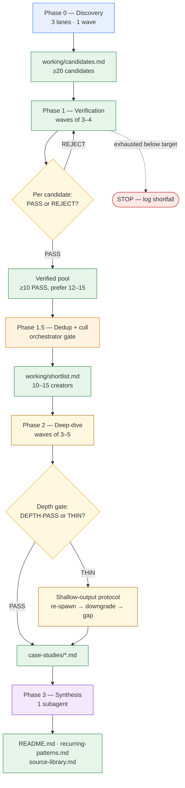

Ask me any questions, and review with me before starting.

You are the **main orchestrator** (primary agent). Spawn one `b0tts-lead-researcher` subagent as the lead for each wave; each lead spawns all of its `b0tts-researcher` workers in ONE message (parallel fanout) and waits for all of them. Only `b0tts-lead-researcher` subagents may spawn subagents — never give spawn tasks to `b0tts-researcher`, `general`, or `explore` agents. `explore` agents are for misc non-lead tasks (date pulls, individual page fetches, spot-checks). Everything is already set up — just follow the workflow.

# Research Mission: Deep-Documented Long-Form Video Workflows — V3

## Goal
Find workflows/formulas/frameworks that long-form video content creators have documented **in depth, publicly** — step-by-step processes they use to make consistently high-performing videos. I want the actual formulas, not vibes: opening hooks/cold opens, structure/act design, pacing, retention mechanics, editing rhythm, posting cadence, replication tactics. Genre is irrelevant — I only care about frameworks with a proven, documented track record.

**Target format:** edited YouTube long-form videos, roughly 10–30 minutes — video essays, deep dives, explainers, documentary-style, storytelling, edited commentary-comedy. **Exclude:** podcasts, livestreams, let's-plays/walkthroughs, raw unedited vlogs, music videos, compilations/reaction channels, news broadcasts. The workflow is the point — genre only matters insofar as it's edited, single, cohesive, and not a talk-format episode.

## Scope (hard requirements)
- **10–15 creators total.** Quality over quantity — pick the best-documented.
- **Verification bar (STRICT):** creator must be verified OR have a long public career, PLUS consistent evidence of 100k+ views per video, PLUS verifiable career evidence (sub counts, documented earnings/brand deals, media coverage, platform stats). Reject anything borderline.
- **View-magnitude preference:** 1m+ median-view creators are prioritized for inclusion; 10m+/video creators anchor the top of the shortlist and rank highest. Magnitude drives ranking.
- **Recency cutoff applies to BOTH surfaces — hits AND documentation:**
  - **Hits:** consistent-hit content within **2021–2026**. Older virality is excluded no matter how famous.
  - **Documentation:** the workflow explanations must also stem from **2021–2026** sources. A creator whose process write-up is frozen at 2019 is excluded — algorithms evolve, and stale workflows don't replicate. Tie the recency cutoff to the *source date*, not just the creator's career timeline.
  - **Staleness tag:** every citation carries a `still-current as of 2026?` flag (YES / NO / UNCLEAR + one-line reason). A 2021 source that the creator has since publicly revised is flagged NO with a pointer to the newer version.
- **Dominance weighting:** when selecting, rank candidates by how *recently* and *consistently* they produce hits, weighted toward view magnitude. Recently-active-and-dominant beats famous-but-fading.
- **Documentation requirement:** the creator must have publicly explained their workflow (strategy videos, breakdowns, blogs, podcast appearances, interviews, course summaries). Skip creators who hit big but never explain how.
- **Source-author provenance:** flag each documentation source as FIRST-PARTY (creator explains own process) vs SECOND-HAND (analyst/reseller repackages it). Deep-dives weight first-party sources; second-hand claims carry a caveat and don't count toward verification.
- **Incentive bias:** flag each documentation source as MONETIZED (the explanation is tied to a course, community, or product the creator sells — treat as marketing until corroborated) vs INDEPENDENT (candid podcast/interview/breakdown with nothing attached to sell). Weight INDEPENDENT sources higher; a workflow described only in MONETIZED sources is a caveat, not a verified formula.
- **Language scope:** English-language documentation only. A non-English creator qualifies only if their workflow is documented in English.

## Consistency test & dominance score (measurement protocol)

### Consistency test (the definition of "consistent hits")
"Consistent" is mechanical, not impressionistic:
- **Hit-rate floor:** ≥60% of the creator's **last 12 eligible public videos** exceed 100k views, evidenced by per-video counts — never a channel-level claim. Report median views alongside.
- **New-upload exclusion:** exclude videos **<14 days old** from the hit-rate computation — long-form accumulates views slower than short-form, and a brand-new upload reads as a false "flop." YouTube flat mode returns no upload dates, so exclude the first 1–2 rows instead, and pull dates for the newest few videos individually to verify recency.

### Measurement protocol — yt-dlp, not browsing
View counts are pulled with yt-dlp, not eyeballed from the platform UI:

```bash
# YouTube long-form (exact counts; /videos tab is reverse-chronological so row order = recency)
yt-dlp --flat-playlist --playlist-end 12 \
  --print "%(view_count)s | %(title).50s" "https://www.youtube.com/@HANDLE/videos"
```

Platform caveat:
- **YouTube flat mode returns no upload dates** (all NA). "Last 12 by position" is the recency proxy — fine for the consistency test — but the 2021–2026 hits window is auditable by pulling dates for the newest few videos individually, or by citing dated third-party coverage.
- Candidates with no YouTube presence cannot qualify (the target format is YouTube long-form).

### Dominance score (fixed formula — identical across all agents)
Every agent computes dominance with the same formula so scores are comparable at the dedup gate. Magnitude is weighted heaviest, per the view-magnitude preference:

`dominance = 0.3 × hit_rate + 0.5 × hit_magnitude + 0.2 × activity`

- `hit_rate` (0–1): share of the last 12 eligible videos above 100k views (per the consistency test).
- `hit_magnitude` (0–1): median views of those videos ÷ 10,000,000, capped at 1.0 → 10m/video = 1.0, 1m = 0.1, 100k = 0.01.
- `activity` (0 / 0.5 / 1): most recent upload ≤30 days ago = 1.0; ≤90 days = 0.5; older = 0 (windows widened for long-form cadence, which is weekly-to-monthly, not daily).

Report the three inputs and the arithmetic for every candidate — the ranking must be reproducible from the listed numbers.

## Depth gate (STRICT — applies to every case study)

A case study qualifies only if:
- **First-party:** the creator publicly explains their own workflow (strategy videos, breakdowns, blogs, podcast appearances, interviews, course summaries). Creators who hit big but never explain how are excluded.
- **Deep:** every workflow step carries ≥1 first-party source link, every claim is linked, and verified-vs-claimed + caveats + contradictions are all explicit. As deep as the sources support — no fixed length; padding to hit a length is a failure mode.
- **Thin sources:** if sources run thin, say so explicitly and stop. Never pad.

## Orchestration — 3-tier wave pattern

You are the main orchestrator. Keep your own context under 60–80k tokens at all times. Spawn waves **sequentially**: one wave-lead `task` call at a time; each blocks until the lead returns its final message.

### Wave lifecycle

1. Before each wave, write the wave spec: `working/waves/wave-0N.md` — wave goal, roster (names/URLs), per-researcher task prompt (≤150 words each, with exact output paths and required return format), completion criteria, QA checklist.
2. Spawn the lead with:
   > You are Wave N lead. Read `working/waves/wave-0N.md` and execute it exactly. Spawn all researchers in ONE message (parallel fanout). Wait for all to finish. Read each researcher's final summary only — never read their full docs into your context. Write `working/waves/report-0N.md` (per-researcher status, verdicts, anomalies, next actions). Final message: ≤500 words.
3. **QA gate:** verify every expected file exists, verdicts match the evidence, the report is written. Then append one line to `working/MANIFEST.md` (wave number, result, counts, next wave).
4. On resume or context compaction: read `working/MANIFEST.md` first — disk is your memory.

### Context budget rules (bake into every subagent prompt)

- **Researchers:** full work product goes to disk only. Final message ≤250 words (status, file paths, verdict). Never paste doc content into the final message.
- **Wave leads:** context = wave spec + researcher summaries only. Never read full docs.
- **You:** only wave summaries enter your context (~500 words per wave). Specs live on disk, not in your working memory.

### Failure handling

- Lead dies mid-wave → resume its session via `task_id`, or re-spawn fresh with "resume from `working/MANIFEST.md`".
- Researcher fails → verdict `FAIL-UNKNOWN`; retry once with the same spec.

## Phases

### Phase flow at a glance

The phases run strictly sequentially — one wave-lead `task` call at a time, each blocking until it returns. The non-trivial parts are the two decision gates (verification, depth) and the shortfall loops that keep counts at or above their floors without ever lowering a gate.



Solid arrows = phase/data flow downstream; dotted = exception path; the two diamonds are gate decisions. Arrow convention is identical across the whole doc: `A --> B` means B depends on A's output.

Each phase below is documented with the same action-first fields: **Goal**, **Wave shape**, **Inputs (read from disk)**, **Per-researcher task**, **Outputs (written to disk)**, **Gate / exit criteria**, **Replenishment & failure**, **Lead QA checklist**, **Edge cases**. Wave lifecycle, context budgets, and general failure handling live in the Orchestration section above; this section covers what is specific to each phase.

### Phase 0 — Discovery (partition by evidence type)

- **Goal:** produce a broad, sourced candidate pool so later phases never stall for lack of names. Done = `working/candidates.md` holds ≥20 unique, schema-complete candidates.
- **Wave shape:** 1 wave, 3 discovery researchers in parallel. Each researcher owns a distinct discovery lane, partitioned by the *kind of evidence* a creator's documentation comes in, so outputs don't overlap:
  - **Lane A — Course/blog authors:** creators who published written frameworks (blogs, course summaries, Substacks, public deck breakdowns). Returns up to 15 candidates.
  - **Lane B — Podcast/interview circuit regulars:** creators whose process is documented across public podcasts/interviews. Returns up to 15 candidates.
  - **Lane C — Channel strategy-video creators:** creators who film their own "how I make my videos" breakdowns on their channel. Returns up to 15 candidates.
- **Inputs (read from disk):** none — first phase. The orchestrator seeds each researcher with its lane assignment.
- **Per-researcher task:** return candidates that plausibly pass the verification bar (Scope). Padding the list to hit a quota is a failure mode — an agent that finds 6 strong candidates returns 6. Per candidate record: name/handle, niche/format, a verification-status lead URL, the channel URL (for the yt-dlp protocol in Phase 1), ≥1 first-party doc URL (own blog/YouTube/course/podcast/interview) that looks like it contains their actual process, and notes. Discovery researchers do **not** run the verification test or the consistency test — that is Phase 1. They flag uncertainty honestly (`role unconfirmed`, `doc URL looks like a listicle`).
- **Outputs (written to disk):** all three append to one shared `working/candidates.md` using a fixed row schema so the merge is trivial:
  ```
  - **Name (handle)** — niche/format: … — verification lead: <url> — channel: <url> — first-party doc: <url> — notes: …
  ```
  The lead dedupes by handle after the wave and writes the final `working/candidates.md`. Target ≥20 unique candidates after dedup.
- **Gate / exit:** phase done when `working/candidates.md` exists with ≥20 unique, schema-complete rows (each has name + ≥1 verification lead URL + channel URL + ≥1 first-party doc URL). If a lane returns <7 or rows miss fields, the lead re-runs that one lane with a targeted prompt before declaring the wave done.
- **Replenishment & failure:** if a lane still returns thin results after one retry, the lead absorbs overflow from the other two lanes rather than blocking. Discovery is cheap — never stall Phase 0.
- **Lead QA checklist:** dedup done; every row has a verification lead URL, a channel URL, and a first-party doc URL; lane coverage balanced (no lane contributing <4 final candidates); weak rows flagged with `?` so Phase 1 scrutinizes them first.
- **Edge cases:** common-name collisions (two creators sharing a name) — disambiguate with a product/channel or handle in the row. Candidates whose only documentation is a secondhand analyst repost → tag `SECOND-HAND-only` so Phase 1 scrutinizes them first.

### Phase 1 — Verification

- **Goal:** run the strict verification bar and the consistency test on every candidate and accumulate a verified pool of **≥10 PASS (prefer 12–15 for margin)**.
- **Wave shape:** waves of 3–4 candidates, one researcher per candidate, parallel within a wave. Waves repeat until the verified pool hits target or `candidates.md` is exhausted.
- **Inputs (read from disk):** `working/candidates.md` (roster) + `working/MANIFEST.md` (resume state — which candidates are already verdicted). Each researcher reads only their assigned candidate's row.
- **Per-researcher task:** for one named candidate, run the checks in order:
  1. **Verification bar** — creator verified OR has a long public career; PLUS consistent evidence of 100k+ views per video; PLUS verifiable career evidence (sub counts, documented earnings/brand deals, media coverage, platform stats). Borderline → REJECT.
  2. **Recency** — hits within 2021–2026 (audit by pulling dates for the newest few videos individually — flat mode returns no upload dates); documentation sources must be 2021–2026; every citation carries a `still-current as of 2026?` flag (YES / NO / UNCLEAR + one-line reason). Hits or documentation frozen pre-2021 → REJECT.
  3. **Consistency test** — run the yt-dlp protocol from the measurement-protocol section: ≥60% of the creator's last 12 eligible videos exceed 100k views, evidenced by per-video counts, never a channel-level claim; report median views; exclude videos <14 days old (or the first 1–2 rows when dates are unavailable).
  4. **Dominance score** — compute with the fixed formula (`0.3 × hit_rate + 0.5 × hit_magnitude + 0.2 × activity`); report the three inputs and the arithmetic so the ranking is reproducible.
  5. **Documentation requirement** — the creator must have publicly explained their workflow; flag each source FIRST-PARTY vs SECOND-HAND and MONETIZED vs INDEPENDENT; English-language documentation only.
  6. **Magnitude note** — record the view-magnitude preference tier (1m+ median prioritized; 10m+/video anchors the top of the shortlist).
- **Outputs (written to disk):** `working/evidence/<creator-slug>-dated.json` — a structured record: `name`, `handle`, `platform`, `niche/format`, verification status + career evidence (with links), recency audit (newest upload dates, doc source dates, staleness flags), consistency test (hit-rate, median, per-video counts), dominance (three inputs + arithmetic), documentation sources (with provenance + monetization flags + dates), `verdict` (PASS/REJECT), rejection reason if any, and the dead-ends searched. Researcher's final message to the lead is ≤250 words: verdict + path + one-line reason.
- **Gate / exit:** phase done when PASS verdicts ≥10 — prefer to keep going to 12–15 for margin before stopping. Stop early only if `candidates.md` is exhausted; if exhausted below 10 PASS, the target is unreachable — the lead logs the shortfall and the orchestrator decides whether to lower the ceiling (never the gates) or stop the run.
- **Replenishment & failure:** a REJECT costs nothing — continue to the next candidate in the next wave. A researcher that dies or returns `FAIL-UNKNOWN` → retry once with the same spec; a second failure → record `FAIL-UNKNOWN` and move on. Never re-spawn more than once per candidate.
- **Lead QA checklist:** every expected `evidence/*.json` exists; every PASS is backed by a hit-rate figure and dominance arithmetic inside the JSON (a PASS with no numbers → flag and re-run); every REJECT carries a reason and the dead-ends searched; the verified-pool count in the report matches the count of PASS JSONs on disk.
- **Edge cases:** a creator whose view claims are channel-level only → reject unless per-video counts confirm. Estimate-grade third-party trackers as the only source → reject. A creator with multiple channels → pick the single strongest eligible channel; don't stack weak channels to manufacture a pass.

### Phase 1.5 — Dedup + cull gate (orchestrator gate — no subagents)

- **Goal:** funnel the verified pool into a ranked shortlist of 10–15 as a self-contained evidence packet, so neither you nor the deep-dive agents (which spawn fresh, with no discovery memory) ever have to re-derive anything.
- **Who runs it:** you, the orchestrator — it is a decision gate over on-disk evidence, not a research task. Culling is non-negotiable and rule-based:
  - Merge duplicates across lanes (track which lanes surfaced each candidate).
  - Apply hard cuts: fails verification, hits pre-2021, documentation frozen pre-2021, or no first-party workflow explanation. (Most are already REJECTs from Phase 1 — this is the second net.)
  - Rank survivors by dominance score ≥ documentation depth ≥ recency. Magnitude-weighted dominance puts the 1m+/10m+ creators at the top.
  - Trim to 10–15: if more than 15 PASS, keep the top 15 by rank and log the cuts.
- **Output:** `working/shortlist.md` — the ranked shortlist as a self-contained evidence packet. Each entry MUST include, in-line: creator name, handle, platform(s); verification status + career evidence (sub count, brand deals, media coverage) with links; view-count evidence (representative videos + per-video view range) with links; dominance score + how it was computed (the three inputs and arithmetic); documentation depth (which sources, FIRST-PARTY vs SECOND-HAND, MONETIZED vs INDEPENDENT, source dates, `still-current as of 2026?` flags); and a pointer to the single best starting source for the deep dive.
- **Shortfall fallback:** if fewer than 10 candidates survive the cuts, run one additional discovery wave with new search angles (new niches, new evidence-type queries). If still fewer than 10, proceed with the survivors and note the shortfall in the README. Never relax the 2021–2026 recency cutoffs or the verification bar to fill the list.
- **Gate / exit:** `working/shortlist.md` exists with 10–15 complete entries (or a logged shortfall), and every deep-dive seed (best starting source) is present.
- **Do not skip the discovery or dedup phase.**

### Phase 2 — Deep-dive (one agent per creator, parallel, WAVES not one-shot)

- **Goal:** turn every shortlisted creator into an exhaustive `case-studies/<creator-slug>.md` that passes the depth gate.
- **Wave shape:** waves of 3–5 creators, one researcher per creator, parallel within a wave — not 10–15 simultaneously (parallel writers risk context/quality variance). Pull from the shortlist in ranking order (strongest first) so the best docs are secured early.
- **Inputs (read from disk):** the creator's `working/shortlist.md` entry (carries sources + the pointer to the best starting source) + `working/MANIFEST.md`. The researcher does **not** re-verify — verification is settled; they spend their budget on the workflow doc itself.
- **Per-researcher task:** read the creator's first-party documentation end to end (strategy videos via the `youtube-transcript` skill — most-recent-first; blogs; podcasts; interviews; course summaries). Write the case study in the creator's own terms — **no imposed extraction schema.** Let each creator's framework speak for itself: their vocabulary, their structure, their mechanics. Do not force-fit creators into a common vocabulary; if a shared pattern exists across creators, it will surface in synthesis. Guidance, not fields — a thorough case study generally covers (where the creator documents it): how they open the video, structure/act design, pacing and retention strategy, editing rhythm, posting cadence, and how they say to replicate without burning out. Skip anything the creator doesn't address — don't invent it. The depth gauge: every workflow step has ≥1 first-party source, every claim is linked, and verified-vs-claimed + caveats + contradictions are all explicit. If sources run thin, say so explicitly and stop — do NOT pad to hit a length.
- **Outputs (written to disk):** `case-studies/<creator-slug>.md`. Researcher's final message ≤250 words: verdict (DEPTH-PASS / THIN) + path + one-line reason.
- **Gate / exit:** phase done when every shortlisted creator has a case study that passes the depth gate. Quality-gate each case study before synthesis — if shallow/thin despite adequate sources, re-spawn that creator's researcher with a different angle or downgraded evidence tier (see Shallow-output protocol).
- **Replenishment & failure:** there is no replacement pool — the shortlist IS the deliverable set. A THIN case study is handled by the Shallow-output protocol (re-spawn → downgrade → explicit gap), never by silently swapping creators. `FAIL-UNKNOWN` → retry once with the same spec.
- **Lead QA checklist:** every expected `case-studies/*.md` exists; every workflow step carries a source link (a step with no link → flag for re-run); THIN verdicts carry explicit gap statements rather than padded prose; the doc count in the report matches the files on disk.
- **Edge cases:** a paid course behind a paywall → cite only what is publicly readable (free summaries, breakdowns, previews); never fabricate steps from marketing copy; never ask the user to pay. A process scattered across many short posts → synthesize into ordered steps but link each step to the specific post that states it.

### Phase 3 — Synthesis

- **Goal:** produce `README.md`, `recurring-patterns.md`, and `source-library.md` from the full set of case studies plus the shortlist and wave reports.
- **Wave shape:** a **single `b0tts-researcher` subagent** (it spawns nothing), not a wave of researchers — synthesis needs one mind holding all the docs' structure at once. It reads summaries/structure of wave reports but full case studies (by design — synthesis requires comparing them).
- **Inputs (read from disk):** all `case-studies/*.md`, `working/shortlist.md`, all `working/waves/report-*.md`, and `working/MANIFEST.md`. It does not re-verify; it trusts the gates.
- **Per-task:**
  - `README.md` — topic overview, methodology (incl. survivorship-bias caveat), dominance-ranked creator list; a new reader can pick a framework in 5 min.
  - `recurring-patterns.md` — built bottom-up per the Emergent patterns discipline: claim-frequency table, ≥2 slugs per pattern with specific sources, format-agnostic vs format-specific tags. Build a comparison matrix only if common axes genuinely surface across case studies; otherwise let the patterns section carry the cross-creator view. Do not fabricate a matrix to fill a slot.
  - `source-library.md` — all links organized per creator with full per-source metadata (title, URL, source date, source type, FIRST-PARTY vs SECOND-HAND, MONETIZED vs INDEPENDENT, staleness flag).
- **Outputs (written to disk):** the three files at the research root.
- **Gate / exit:** phase done when all three files exist, every shortlisted creator appears in the README ranking and the source library, and the claim-frequency table is complete. The orchestrator does the final reconciliation against the acceptance checklist before declaring the whole run done.
- **Replenishment & failure:** synthesis is terminal — no replenishment. If the agent's output is incomplete (missing creators, empty claim-frequency table), re-spawn once with the specific gaps called out. If it still fails, the orchestrator writes the missing pieces directly from the on-disk docs — the docs are the source of truth.
- **Edge cases:** a creator whose workflow is unusually short still gets a full section — "short" is a finding, not a drop reason. Because this agent reads all case studies, watch its context budget: if the shortlist is at the ceiling (~15) and docs are long, have the agent read in two passes (extract structure first, then write) rather than all at once.

## Cross-phase mechanics

- **Disk is memory.** Every phase reads inputs from disk and writes outputs to disk. `working/MANIFEST.md` is the resume index — one line per wave (wave number, phase, result, counts, next action). On any resume or context compaction, the orchestrator reads MANIFEST first and reconstructs state from it plus the on-disk files. No phase relies on anything that lives only in an agent's context.
- **Wave handoff contract.** Each phase's output is the next phase's input, fixed by file schema. A phase never starts until its input contract is satisfied on disk — the lead checks this in QA.

  | Handoff | Producing phase | File(s) | Consuming phase | What the consumer needs from it |
  |---|---|---|---|---|
  | 0 → 1 | Phase 0 | `working/candidates.md` | Phase 1 | name/handle + verification lead + channel URL + first-party doc URL per row |
  | 1 → 1.5 | Phase 1 | `working/evidence/*.json` (PASS records) | Dedup + cull gate | hit-rate + dominance arithmetic + source flags to rank and cut |
  | 1.5 → 2 | Phase 1.5 | `working/shortlist.md` | Phase 2 | ranked creators + best starting source per creator |
  | 2 → 3 | Phase 2 | `case-studies/*.md` | Phase 3 | the full case studies to synthesize across |

- **Replenishment, one rule.** Whenever a candidate fails verification and the PASS count is at risk of falling below the ≥10 floor, pull the next candidate from `candidates.md` before declaring the phase done. **Never lower a gate to avoid a pull.** If the pool is exhausted below the floor, stop and log the shortfall — that is a valid, honest outcome.
- **Gate decision log.** Every verdict (PASS / REJECT / DEPTH-PASS / THIN / FAIL-UNKNOWN) is persisted in its evidence JSON or wave report with a reason and the dead-ends searched. This makes the run auditable: a reader can reconstruct why any creator was included or excluded without re-running the research.
- **Context discipline recap.** Researchers write full work to disk and return ≤250-word summaries; wave leads read only summaries + the wave spec, never full docs (Phase 3's synthesis agent is the single exception by design); the orchestrator sees only wave reports (~500 words each). This is what keeps a multi-wave, multi-creator run inside the 60–80k orchestrator budget.
- **Wave spec template.** Before each wave the orchestrator writes `working/waves/wave-0N.md` with: wave goal, phase, roster (names/URLs), per-researcher task prompt (≤150 words, exact output paths, required return format), completion criteria, QA checklist. The lead executes it verbatim — the spec is the single source of truth for what the wave must produce.

## Emergent patterns (cross-reference discipline)
The "what works across the board" section is NOT impressionistic and is NOT imposed — it is built bottom-up by reading the case studies and finding what actually recurs:
- A **claim-frequency table:** `tactic → number of case studies that cite it → list of creator-slugs`.
- Every pattern entry must reference **≥2 case studies by slug + a specific source from each.** A tactic seen in only one creator is a tactic, not a pattern.
- Patterns get tagged `format-agnostic` (works across video-essay / deep-dive / explainer / documentary-style / edited commentary-comedy) or `format-specific` (tied to one format). Do not assume a tactic is universal — if it shows up in only one format, tag it.

## Tools & sources
- Web research: websearch/webfetch, creator channels, podcasts, interviews, blogs, articles — anything public.
- **Researcher tooling (harness-verified):** primary search `websearch`. SearXNG MCP returns empty from subagent context — try once, then move on. Read a page before citing it — search snippets are discovery, not evidence. Utilize the opencode web research skill.
- Verification numbers come from the yt-dlp protocol (measurement-protocol section), never from eyeballing the platform UI.
- Paid content (courses/books): only capture if obtainable for free (summaries, breakdowns, leaked structure). Never ask me to pay; never pirate.
- **YouTube transcripts:** use the `youtube-transcript` skill (yt-dlp) for creators' strategy videos — transcripts go to `b0ttsagent/temp/youtube-transcripts/`. Always read the skill's SKILL.md first. **Sample most-recent-first:** recency is the binding constraint, so transcribe the creator's newest strategy/breakdown videos before older ones; older videos are fill-in only after the recent record is captured.

## Output structure

Under `b0ttsagent/research/long-form-video-frameworks/`:
- `README.md` — topic overview, methodology (incl. survivorship-bias caveat), dominance-ranked creator list; a new reader can pick a framework in 5 min
- `recurring-patterns.md` — emergent cross-creator patterns, with the claim-frequency table and ≥2-slug sourcing per pattern
- `source-library.md` — all links organized per creator. Per-source metadata, not bare URLs: title, URL, source date, source type (strategy video / podcast / blog / interview / course summary), FIRST-PARTY vs SECOND-HAND, MONETIZED vs INDEPENDENT, `still-current as of 2026?` flag
- `case-studies/<creator-slug>.md` — one file per creator, documented in the creator's own terms, as deep as sources support (no imposed schema)
- `working/` — wave machinery (working files only, never final docs):
  - `working/candidates.md` — discovery pool
  - `working/evidence/<creator-slug>-dated.json` — per-candidate verification records
  - `working/shortlist.md` — the self-contained ranked evidence packet (Phase 1.5)
  - `working/waves/wave-0N.md` + `working/waves/report-0N.md` — wave specs and reports
  - `working/MANIFEST.md` — resume index, one line per wave

## Non-negotiables
- Every claim in every doc must be linked to a source.
- Each creator's framework must be documented **individually and deeply** — no merging creators into one blob.
- Patterns must be built from the case studies, with cross-references back to them.
- If a creator fails verification mid-research, drop them and note the exclusion.
- Anything stale (no hits since 2021, OR documentation frozen since 2021) is out, period.
- Never lower the verification or depth gates to hit counts.
- Working files only under `working/`. Final docs only at the paths above.
- Only summaries flow into orchestrator contexts — never full docs.
- Only `b0tts-lead-researcher` subagents spawn subagents.

## Acceptance checklist (definition of "done and good")
All must be true before synthesis is signed off:
- [ ] Every claim in every doc linked to a source
- [ ] ≥2 primary (first-party) sources per case study, or an explicit "thin sources" caveat
- [ ] Dominance ranking reproducible from the listed stats (show the numbers — the three inputs and arithmetic)
- [ ] Source library entries carry full metadata (date, type, provenance, monetization bias, staleness flag)
- [ ] Claim-frequency table completed; every pattern refs ≥2 slugs + sources
- [ ] Patterns tagged format-agnostic vs format-specific
- [ ] Staleness tags (`still-current as of 2026?`) present on every citation
- [ ] README includes survivorship-bias caveat and lets a new reader pick a framework in 5 min
- [ ] `working/MANIFEST.md` has one line per wave; every expected evidence JSON and wave report exists
- [ ] Shortlist, case studies, and README ranking reconcile (counts match)

## Shallow-output protocol
If a case study comes back thin despite adequate surfaced sources:
1. Re-spawn that creator's deep-dive agent with a different angle prompt (new source trail, different framing).
2. If still thin after one re-spawn, **downgrade the creator's evidence tier** (FIRST-PARTY → SECOND-HAND caveated, or mark "documentation insufficient") rather than inflate.
3. If thin because sources genuinely don't exist, keep it but write the gap explicitly — never pad.

## Survivorship-bias caveat (state in README methodology, top)
These are **winners'** workflows — documented by creators who already broke out. Frameworks correlate with consistent performance; they are not proven to cause it. Treat the output as a high-evidence starting set for replication, not a guaranteed formula. Replicability depends on execution, niche, platform state, and audience you don't have yet.

---

Ask me any questions if you have before beginning.
