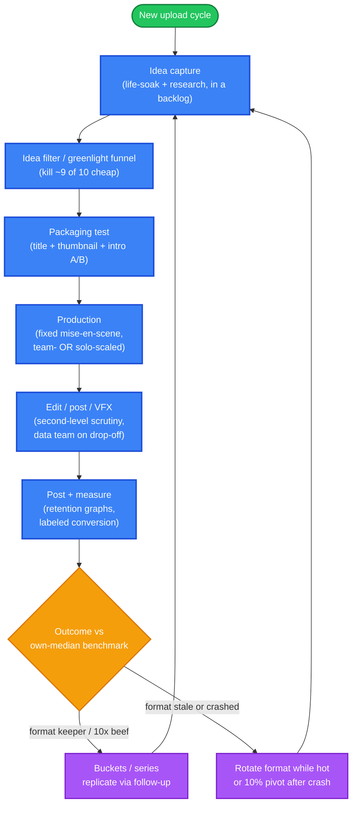

# Recurring Patterns — What Works Across the 10 Documented Workflows

**Purpose:** distill the recurring tactics across the 10 case studies into a quantified claim-frequency table plus source-located parallels. The spec's binding rule: a pattern seen in only one creator is a **tactic**, not a parallel — every parallel entry references ≥2 case studies by slug **and a specific source from each**. Every parallel is tagged `platform-agnostic` or `platform-specific`.

**Reader task:** *understand* (which tactics recur and where the evidence lives), then *decide* (which to test yourself).

**How to read:**
- Slugs = as in `01-comparison-matrix.md`: `zk` Zach King · `mb` MrBeast · `dm` Dhar Mann · `kl` Keith Lee · `ar` Airrack · `sh` Steven He · `cs` Caleb Simpson · `nd` Nick DiGiovanni · `ss` Sam Sulek · `jh` Jenny Hoyos.
- Each parallel body cites **(slug + source tag from that case study)**. Source tags resolve to full URLs / dates / types in `03-source-library.md`.
- "n = X" = number of case studies VERIFIED-citing the tactic (≥1 source per case study, flagged if it's an inference).
- All 10 case studies live under `case-studies/<category>/<slug>.md` (categories: `vfx-illusion`, `mega-creator`, `scripted-microdrama`, `food`, `pranks-challenges`, `comedy-skit`, `man-on-street`, `fitness`, `lifestyle-storytelling`).

---

## Common pipeline across the 10 creators

Every documented workflow moves through the same five stages, whether the creator is solo-tripod (`ss`), whole-team studio (`mb`, `dm`, `zk`), or clip-from-long-form (`ar`, `sh`). What diverges is *what each creator does at each stage*, not the stages themselves.

Arrow semantics: `A --> B` = "B follows A in the workflow." The `Serial --> Idea` and `Rotate --> Idea` back-edges mark the iteration loop — every documented workflow terminates one video by feeding forward into the next (replication tactic of Table D in the matrix).

### What each stage looks like across creators

| Stage | Recurring tactic at this stage | Who practices the explicit version (slug → source) |
|---|---|---|
| Idea capture | Trend-watch + life-soak + a multi-source idea backlog (NOT a blank-page upload day) | `zk` [V2025, Y2023] · `jh` [MFM lines 99-108, 304-310] · `cs` [S1, S8] · `mb` [LEX-2023] · `nd` [S1, S5] · `sh` [CREATORHB] · `dm` [S10] |
| Idea filter / greenlight funnel | A production-cost gate that kills ~9 of 10 ideas cheaply before real spend | `zk` (T-sheet + pulse + mock-up) [V2025, Y2023] · `dm` (10:1 funnel + audience Google Form) [S10] · `ar` (pitch deck + brand filter + follow-up rule) [S1] · `jh` (100→25→10 funnel + 4 criteria) [MFM, CS167] · `mb` (purple-cow test + kill if thumbnail fails) [LEX-2023] · `ss` (anti-gate: "post what you like; small periodic adjustments") [CC147] — explicit diverter, see "Diverges" below |
| Packaging test (title / thumbnail / intro) | Pre-test the click layer with paid or scraped data BEFORE production-level commitment | `mb` (50-concept thumbnail + A/B + closed-mouth A/B win) [APPLEBY-2024, C&S-2024-BG] · `ar` (YouTube Studio split testing; intro obsession) [S1] · `dm` ($10 FB pre-tests, ~100 title variants) [S10] · `jh` (scrapes thousands of shorts for 5th-grade readability benchmark) [CS167 lines 24-45] · `zk` (alt-intro A/B on phone) [Y2023] |
| Production | Recognizable fixed mise-en-scène that lowers marginal production cost per video | `kl` (car + takeout bag + catchphrase) [RS, DMN] · `cs` (one-phone, one long take) [S1, S8] · `ss` (tripod-only, no videographer) [CC147] · `nd` (solo self-filmed Shorts, "no one's allowed in the room") [S1, S2] · `sh` (iPhone for first 220 videos; solo multi-character recording) [TUBEFILTER, CREATORHB] |
| Edit / post / VFX | Second-by-second scrutiny by either a data team or the creator's own retention-graph practice | `mb` (after-action reports vs median last-10) [DOAC-2025] · `dm` (3 edit versions per short; data team analyzes characters/colors/pacing) [S12 BI] · `jh` (1-second trim raised retention 83%→88%; "every second counts = 3% of a 30s short") [CS167 lines 53-61] · `ar` (retention-graph-driven iteration) [S1] · `sh` (Failure Management loop feeding a "quiver") [DRIVEN 2025-12] · `nd` ("trim this by a few milliseconds" pacing notes) [S1] |
| Post + measure (the data loop) | Continuous measurement against own-median benchmarks, not absolute targets | `mb` ("vs the median of our last 10 20-minute videos") [DOAC-2025] · `jh` (every video manually labeled by attribute, graphed against subscriber conversions) [MFM lines 282-297] · `ar` ("a more optimized version of the last video every time") [S1] · `sh` ("CTR 6→7 or 9→15, retention 60→80%; red flag if 5-sec drop cliff") [POP-CULT, CREATORHB] · `cs` ("keep posting, others quit, you'll be there") + inbound pipeline feeds forward [S1, S2] |
| Replicate via follow-up / series | Format serialization so the unit of replication is the bucket/series, not the one-off | `ar` (bucket + "if it doesn't have a follow-up, we're not making it") [S1] · `sh` (56 Asian Dad sketches; product-line portfolio) [TUBEFILTER, DRIVEN] · `cs` (apartment-tour format, rotating cities + celebrity ladder) [S1, S4] · `kl` (tour-batch + "Keith Lee Effect" series across cities) [BC, CSS] · `dm` (moral-template reuse + serialized IP + Fox/Samsung exports) [S3, S7] · `nd` (format slate rotating with 3-idea collab pitches) [S5] |
| Rotate format while hot / pivot after crash | End-on-format-while-not-too-old; small-pivot recovery after a crash | `mb` ("end on a format while it's not too old"; "Beastification" copycat-driven evolution) [C&S-2024-BG] · `sh` (10% pivot doctrine after the 80% Ginormo! crash) [DRIVEN 2025-12] · `dm` ("you have to nail it before you scale it"; doubling ladder) [S3, S10] · `ar` ("more optimized version of the last video") [S1] |

---

## Claim-frequency table

The spine of the parallel section. `n` = number of case studies citing the tactic; the slug(s) follow. Each tactic with `n ≥ 2` becomes a parallel below with source-tag-of-each.

| Tactic / mechanism | n | citing slugs | tag |
|---|---|---|---|
| First-frame / first-second hook doctrine (≤3 sec, often ≤1 sec) | 9 | `zk`, `mb`, `dm`, `kl`, `ar`, `sh` (≤7s), `cs`, `nd`, `jh` (Sam Sulek N/A for long-form but clips embody it) | PS (platform-conditional — see "First-frame timing diverges by platform" below) |
| Curiosity gap | 8 | `zk`, `mb`, `dm`, `kl` (inferred), `ar`, `cs`, `nd`, `jh` — (`sh` rejects, `ss` rejects) | PA |
| Escalating stakes | 9 | `mb`, `dm`, `ar`, `sh` (action-choreo), `cs` (celebrity ladder), `nd` (3-test ladder), `ss` (progress arc), `jh` (secret room + Breaking Bad cited) — (`kl` not claimed) | PA |
| Payoff density | 9 | `zk`, `mb`, `dm`, `kl` (per-dish), `ar` (bits), `sh` (30-joke bank), `cs` (6-min packed), `nd` (compression), `jh` (every-second counts) — (`ss` rejects; ambient is opposite) | PA |
| Visual resets | 7 | `zk`, `mb` (custom sets), `kl` (each new dish), `ar` (costumes), `sh` (camera-move comedy), `cs` (room-to-room), `nd` (continuous beats) — (`jh` rejects; clean single focus; `ss` rejects; `dm` not claimed) | PA |
| Reaction bait | 5 | `dm`, `kl`, `cs`, `sh` (implicit via meme), `jh` (personal life for comments) | PA |
| Stakes reset | 0 | none | (verified absence — not a parallel) |
| Open-question stack | 0 (all reject) | none (`kl`, `cs`, `jh`, `ss`, `nd` explicitly reject) | PA (negative finding) |
| Closed-loop in-video | 9 | `zk`, `mb` (INFERRED), `dm`, `kl`, `ar`, `sh`, `nd` (Shorts), `jh` | PA |
| Open-loop / series-level loop | 6 | `kl` (city-tour), `ar` (follow-up rule), `sh` (character continuity), `nd` (A-Z open on long-form), `cs` (rejection-clip DM loop), `ss` (daily serialized progress) | PA |
| **Pipeline funnel / formalized idea gate** | 7 | `zk`, `dm`, `ar`, `jh`, `cs`, `kl`, `mb` (purple-cow kill) | PA |
| **A/B split-testing packaging** (title/intro/thumbnail) | 5 | `zk`, `mb`, `ar`, `dm`, `jh` | PA principle / PS via YouTube Studio split-test + FB paid test |
| **Serial / bucket / character reuse** | 6 | `ar`, `sh`, `cs`, `kl`, `dm`, `nd` | PA |
| **Inbound supply pipeline** (outbound → inbound inversion) | 5 | `cs`, `kl`, `ar`, `dm` (audience Google Form), `jh` (1000-idea backlog + strategist gate) | PA |
| **Retention-data loop** | 8 | `mb`, `sh`, `ar`, `jh`, `dm`, `nd`, `zk` (pulse + mock-up kill), `cs` (inbound feeds forward) | PA principle / PS via YouTube retention graph UI |
| **Fixed mise-en-scène** (recognizable + low marginal cost) | 5 | `kl`, `cs`, `ss`, `nd`, `sh` (iPhone-era) | PA |
| **Anti-padding / make-a-banger-not-spam** | 6 | `nd`, `sh` (named regret), `zk` ("let it ride"), `mb` ("kill formats hot"), `dm` ("nail it before you scale it"), `kl` ("palace of desperation") | PA |
| **10× rule / 100-video improvement loop** | 7 | `cs`, `mb`, `dm`, `sh` (Failure Management doctrine + $100M-rule), `ar` (retention iteration series), `ss` (years-no-reward gradual), `jh` (attribute-labeled vs-own-baseline outlier analysis) | PA |
| **End pre-promised (foreshadow / A-Z endpoint / promise-the-ending)** | 6 | `jh`, `nd`, `mb`, `dm`, `ar` (A-plot = title), (`zk` implicit via promise-at-end philosophy) — (`ss` explicitly: "the same as the previous one" — anti-pattern) | PA |
| **Visible progress tracker (mechanism)** | 5 | `jh` (budget counter, 3 steps), `nd` (A-Z map + completion audio motifs), `cs` (rent number closer), `kl` (decimal rating scale), `ss` (Day-N bodyweight arc) | PA |
| **Peak-end / twist-ending** | 3 | `jh`, `zk`, `dm` | PA |
| **Show-don't-tell story compression** (visual transformation) | 3 | `dm` (wife's pivot), `nd` (ingredients→finished product), `jh` (visual-understood-without-listening) | PA |
| **Brand-filter / word-level novelty gate** | 3 | `ar` (one-word "mischief"), `mb` (purple cow never-seen-before), `jh` (4 idea criteria; novelty+uncertainty+curiosity+complexity) | PA |
| **Multi-language dubbing** | 2 | `nd` (15 langs; shapes which ideas ship), `mb` (14–20 langs; YouTube built native dubbing partly for him) | PS (platform-specific to YouTube + audio distribution surfaces) |
| **Cost discipline per idea** | 4 | `ar`, `zk` (budget tiers; "money is not the fix"), `kl` (giving economy, Dasher trough), `nd` (no producer, "tight and quiet"), `ss` (zero production) | PA |
| **Shorts-as-discovery-funnel to long-form** | 7 | `mb`, `dm`, `ar` (clipping economy), `ss` (TikTok→YT), `sh` (60× TikTok reach), `nd` (TikTok→YT retention), `kl` (shorts-derived long-form podcast + show) | PS (YouTube-as-ecosystem platform-specific) |
| **Long-form-first with shorts as derivatives** | 5 | `mb`, `ar`, `ss`, `sh`, `nd` (cadence-shifted; the dataset's bulk) | PS weight on platform-specifics axis — see "Long-form-first creators deprioritized on platform-specifics" below |
| **Crash-and-recovery arc** (format experiment fails, channel-wide damage, learning doctrine) | 2 | `sh` (80% Ginormo! crash + 10% pivot recovery), `mb` (self-superseded 2021→2024 "we were slightly wrong" pivot) | PA |
| **Time-of-day posting rule** | 0 | none of 10 document one — verified absence across the entire dataset | PA (in the sense of "absent on every platform") |

---

## The parallels (each ≥2 slugs + a specific source from each)

### P1. First-frame hook doctrine — ≤1 second on Shorts, ≤7–10 seconds on long-form YouTube

- **n = 9** cite the doctrine (Zach King, MrBeast, Dhar Mann, Keith Lee, Airrack, Steven He, Caleb Simpson, Nick DiGiovanni, Jenny Hoyos). Sam Sulek N/A for long-form but the TikTok clips embody it (5-second edits).
- `ar` [S1] — **explicit, most prescriptive**: "the first one second of the video is the most important second of the entire video"; "a video becomes exponentially less important every second that goes by."
- `jh` [blog.youtube — 2025-01-28 YouTube Blog] — **explicit**: "you have one second to hook someone, especially on Shorts."
- `nd` [S1 Colin & Samir] — **explicit**: "show some visuals, some color right out of the gate… it just doesn't make sense to explain it when you can show it right away"; full click-confirmation completes by ~7 sec.
- `mb` [C&S-2021-48M] — explicit *for long-form*: "the thing people undervalue the most is literally the first 10 seconds"; first-frame for shorts is the inference flagged in `mb`.
- `sh` [CREATORHB 2023-10] — explicit 7-second window: "I usually have my biggest joke in the first seven seconds."
- `dm` [S9 Kafka chapter + S10 BigDeal] — implied via "start with the climax" + "deliver on the premise right away" (the 0–1s case study flag = INFERRED, no source names sub-second).
- `kl` [DMN] — catchphrase begins each review; published descriptions only (case study flags as 0–1s INFERRED).
- `cs` [S4 RS Rolling Stone + S8 Realtor.com] — "runs up to people on the street and asks" — format description; no quantified second-level claim (case study flags as 0–1s INFERRED).
- `zk` [V2025 + PP2022] — "create a good hook at the beginning"; no frame-time number (case study flags as 0–1s INFERRED). **Same inferential pattern as `dm`, `kl`, `cs`** — the explicit-frame-timing finding lands only for `ar`, `jh`, `nd`, `sh`.
- **Tag: platform-specific** — the doctrine splits. On Shorts/TikTok it's a sub-3-second rule (Jenny 1-sec + Nick 7-sec click-confirm + Sam's 5-sec edits); on long-form YouTube it's the 7–10-second rule (MrBeast, Airrack, partially Steven He). Both are first-frame-timing extensions, but the binding window doubles when you leave the Shorts feed.

### P2. Curiosity gap retention — most-cited single mechanism

- **n = 8** (`zk`, `mb`, `dm`, `kl`, `ar`, `cs`, `nd`, `jh`), with 2 explicit rejections (`sh`, `ss`).
- `zk` [AG2026 AllThingsGeek] — "the brain wants to solve the trick before it can fully let go"; rewatch engine.
- `mb` [DOAC-2025] — "have to click or I'm not going to be able to sleep tonight" (purple-cow click curiosity) + "why do I have to watch until the end?" retention principle (relayed via Nick too).
- `dm` [MFM isn't used — use S10 BigDeal + S3 Media Odyssey] — packaging intrigue + climax-first hook create the gap.
- `kl` [S10 AD + EAT] — case-study flag = INFERRED: "will it be a good rating" structurally implied; never articulated as a retention theory by Keith himself.
- `ar` [S1] — intro/title promise = "what the viewer clicked on"; A-plot is the title.
- `cs` [S10 AD] — **explicit stated engine**: "It's really just curiosity: People are generally just curious about how other people live."
- `nd` [S1] — "Why do I have to watch until the end?" is the question every intro must answer.
- `jh` [MFM lines 64-67] — the idea itself must be "a problem that needs to be resolved at the end of the video or a question that's going to get answered."
- **Tag: platform-agnostic.** Psychology-first principle, applicable identically across TikTok/Shorts/Reels/long-form. The divergent group is two: Steven He ("I would deliver a laugh in the thumbnail… punch it"; rejects vague-title curiosity style — [CREATORHB 2023-10]) and Sam Sulek (rejects "you can't just only post stuff that does well because that's when you get into trend videos" — [CC147 Cutler Cast]).

### P3. Payoff density — second-most-cited; the backbone of "make it entertaining every second"

- **n = 9** (`zk`, `mb`, `dm`, `kl`, `ar`, `sh`, `cs`, `nd`, `jh`). Only `ss` diverges (ambient not dense).
- `mb` [LEX-2023] — "every second needs to be entertaining."
- `sh` [CREATORHB 2023-10] — ~30 jokes per video at 7–15 sec cadence (formalized joke-bank).
- `jk` → `jh` [CS167 lines 53-61] — "every single second" matters because 1 sec ≈ 3% of a 30-second short; trimming one dead last second raised retention 83%→88%.
- `dm` [S10 BigDeal] — "we analyze every word… could this sentence be cut out?"
- `nd` [S1] — "trim this by a few milliseconds… that bothers me a lot if the pacing is at all off."
- `ar` [S1] — "content will ooze out of this idea naturally" — bits stay on-A-plot.
- `zk` [V2025] — ~30 audio layers in a ~20-sec short (multiple illusion beats + sound pass).
- `kl` [EAT + DMN] — per-dish micro-ratings packed through the video.
- `cs` [S1] — 2 hours of footage → 6 minute packed cut; 40M-view 6-min Reel.
- **Tag: platform-agnostic**, with one important platform-conditional rider: density is what saves a Shorts watcher mid-scroll (Jenny, Nick) but on YouTube long-form it has a ceiling — MrBeast's 2024 self-supersession ("30-40% slower, 50-60% less yelling") proved denser ≠ better on long-form once retention psychological momentum is established [C&S-2024-BG].

### P4. Updating-style "10× rule / 100-video improvement loop" — the replication engine

- **n = 7** (`cs`, `mb`, `dm`, `sh`, `ar`, `ss`, `jh`).
- `cs` [S1 Trading Secrets + S2 Finding Founders] — "take the top viral videos… recreate it and try to 10x the idea."
- `mb` [LEX-2023] — "make 100 videos, improve something in each video, and then talk to me about your 101st"; "every six months you should look back and hate your previous videos."
- `dm` [S10 BigDeal + S9 Kafka] — "It took me 100 videos to go viral… what if I quit on number 99?"
- `sh` [DRIVEN 2025-12 + CREATORHB 2023-10] — Failure Management Productions (company name + chest text); "by video number 50, 60, 100… that's when you have a solid product"; **$100M-rule** — "if I had $100M, I would spend it on ≥100 videos, not one… by video #100 the system runs completely flawlessly."
- `ar` [S1] — retention-graph iteration: "a more optimized version of the last video every time."
- `ss` [CC147 + MW994] — "years with no reward" gradual 0.1% climb; small periodic analytics adjustments (monthly look-back at "what did I do differently").
- `jh` [MFM lines 299-303] — manually labels every video by attribute, graphed against subscriber conversions; outlier analysis against her **own** baseline, not absolute thresholds.
- **Tag: platform-agnostic.** The mechanism is "rapid iteration against your own median, not against a universal target" — instances differ in framing (_failures-as-data_ for `sh`, _optimized-sequel_ for `ar`, _labeled-attribute-experimentation_ for `jh`) but the engine is identical.

### P5. Closed-loop in-video + open-loop series-level — the two-layer loop

- **Closed-loop n = 9, Open-loop n = 6**, with most creators running both.
- **Closed-loop** (in-video resolves the promise): `zk` ("leave them satisfied but craving more"), `mb` (INFERRED for shorts from title/reward structure), `dm` ("everyone gets a moral by the end"), `kl` (catchphrase → rating cycle), `ar` (payoff inside the bucket unit), `sh` (sketch comedic resolution), `nd` (Shorts = complete transformation ingredients→finished product), `jh` (hook-promise → foreshadow → payoff).
- **Open-loop** (series-level follow-up that pulls the viewer to the next episode): `kl` (city-tour arc — arrival → batch → "redemption" return [BC, CSS]), `ar` ("if it doesn't have a follow-up, we're not making it" [S1]), `sh` (character continuity across 56 Asian Dad sketches [TUBEFILTER + FORBES]), `nd` (long-form A–Z open promise [S1]), `cs` (rejection-clip open-loop closes off-platform via DM [S2, S4, S8]), `ss` (daily serialized Day-N progress, closes by returning tomorrow [CC147]).
- **Tag: platform-agnostic** (closed); the open-loop mechanism has one clearly platform-specific embodiment (`cs`'s rejection-clip DM conversion) and one platform-agnostic embodiment (`ar`'s buckets / `sh`'s character / `nd`'s A-Z across formats).

### P6. End-pre-promised / foreshadow / A–Z endpoint — promise the ending before the middle exists

- **n = 6** (`jh`, `nd`, `mb`, `dm`, `ar`, `zk` implicit). Normalized from Jenny's "foreshadow" New Term + Nick's "A-Z endpoint" New Term.
- `jh` [CS167 lines 152-158, MFM lines 177-182] — "the hook and foreshadow I always do in every video… two lines, 3 seconds or less"; "telling the viewer there's an Amazon gift card at the end…"
- `nd` [S1] — A–Z endpoint doctrine: "what is A and what is Z… the audience now knows what they're waiting for within those first 22 seconds"; completion signaled by recurring audio motifs ("you might know the video's over").
- `mb` [LEX-2023] — title "represents content that you would wanna watch for 20 minutes" (title = implicit Z).
- `dm` [S10 BigDel] — first-10-seconds click-off rule + "deliver on that premise right away"; the title test itself is the Z-promise (packaging-gate New Term).
- `ar` [S1] — A-plot = title ("A plot equals the title on YouTube"); "does it feel like an Airrack video?" branding gated by the title-promise match.
- `zk` [PP2022 + AM2025] — "keep the idea simple, create a good hook at the beginning, deliver on the promise at the end" (the promise is the pre-promised end, even if his sources don't name the technique).
- **Tag: platform-agnostic.** Note `ss` is the explicit anti-instance: "I'm doing like a YouTube intro… that's just not what I do"; "the same as this one" [MW994] — for serialized raw daily content, no end is pre-promised; the reward is the next day, not the end of this video. (Recorded as a deliberate diverter, not a gap.)

### P7. Retention-data loop — measurement-as-system, not measurement-as-mood

- **n = 8** (`mb`, `sh`, `ar`, `jh`, `dm`, `nd`, `zk`, `cs`). The clearest "creators who already broke out explain how they iterate" parallel in the dataset.
- `mb` [DOAC-2025] — **after-action reports**: "the next day I look at the retention and the CTR… here's the retention chart, here's every time someone clicked away, here's where was flattest"; benchmarked against the **median of the last 10 20-minute videos** — "if retention is 11 minutes or above, we did a good job."
- `sh` [POP-CULT + CREATORHB] — Failure Management doctrine → explicit algorithm targets: CTR 6→7% (May 2023) or 9→15% (Oct 2023); retention 60→80%; avg watch time ~15 sec; red-flag = first-5-sec drop cliff.
- `ar` [S1] — retention-graph iteration explicitly — "I get to study the retention graphs and find out what people weren't as interested in and just make a more optimized version of the last video."
- `jh` [CS167 lines 53-61 + MFM 282-297] — 25% last-second dip → trim 1 sec → 83%→88% retention; every video manually labeled (family? wholesome? malicious?) graphed against subscriber conversions: "family + wholesome = 2× conversion but 10× fewer views; prank = regular conversion but 10× views; netting 5× more subscribers."
- `dm` [S12 Business Insider] — data team "examining factors such as characters, colors used, and pacing"; "editors test as many as three versions of each short."
- `nd` [S1] — the ms-level pacing notes ("trim this by a few milliseconds"), 4–6 hours per 20-second intro writing-and-iterate process.
- `zk` [V2025 + Y2023] — pulse votes + mock-ups kill bad ideas cheaply before real spend; A/B intro testing on phone.
- `cs` [S1 + S8] — "I've just been doing it so long and I have my flow and my style" edit in-house; despite case study flagging no analytics per se, his stopping-via-refusals DM-conversion loop and inbound pipeline function as a measurement loop (production feedback).
- **Tag: PA principle, PS execution** — the principle is platform-agnostic; the **execution** is platform-specific in that YouTube Studio (retention graphs + native A/B testing) and TikTok analytics are *the* surfaces the technique currently lives on. Pre-YouTube Studio, the principle was the same but the tools were cruder (`mb` Appleby's internal thumbnail-data tool took ~6 years; [APPLEBY-2024]).

### P8. Pipeline funnel / formalized idea gate — kill ~9 of 10 ideas cheaply

- **n = 7** (`zk`, `dm`, `ar`, `jh`, `cs`, `kl`, `mb`).
- `zk` [V2025 + Y2023] — Monday T-sheets + sticky pulse vote + same-day mock-ups (phone + 3D) kill bad ideas before budget commits.
- `dm` [S10 BigDeal] — 10:1 green-lighting funnel: title → thumbnail → weekly audience Google Form → real thumbnail + casting → 30-sec pitch one-pager → script → 3–4 of 5 advance → ~1 of 10 reaches upload.
- `ar` [S1] — pitch deck weekly: "(a) three thumbnail stories, (b) breakdown of the video, (c) a 'how'"; one-word "mischief" brand filter; follow-up rule.
- `jh` [CS167 lines 110-119] — 1,000-idea Google Doc + 100→25→10 filter; her strategist-editor (NOT "just a video editor") does the 25→10 cut on shareability and "simple yet complex" concept fit.
- `cs` [S5 BI + S1] — invite-only → DMs/emails shown on camera → mass-request vetting pool + prayer → selection.
- `kl` [BC + BL + EI] — invite-only funnel (2023) → mass-request funnel (10-30k requests/hour) + vetting-with-locals + prayer decision (2025).
- `mb` [LEX-2023] — "MrBeast will throw away a video idea if the thumbnail for it would not work" — packaging test as the gate before production-level commitment.
- **Tag: PA principle, PS execution tiers** — the principle is universal; the gate *instrument* is platform-specific to where the audience data lives (Google Form for `dm`/`cs`, FB paid test for `dm`'s $10 pre-test, YouTube Studio split testing for `ar`/`mb`, trending-page scrape for `jh`).

### P9. A/B split-testing of packaging (title / thumbnail / intro)

- **n = 5** (`zk`, `mb`, `ar`, `dm`, `jh`). A subset of P8 but worth separating because the *method of proof* differs.
- `mb` [APPLEBY-2024 + C&S-2024-BG] — ~50 thumbnail/title concepts per video; **closed-mouth face A/B** won 30/30 tests → adopted (and others copied); multistep sketches; internal ~6-year thumbnail-data tool.
- `ar` [S1] — "we can split test into infinity… live in pretty close to the most optimal reality" (YouTube's split-test tooling).
- `dm` [S10 BigDeal] — "$10 paid Facebook pre-test… a hundred different title tests" (paid test for click-through data, NOT YouTube Studio).
- `jh` [CS167 lines 24-35 + 42-45] — scrapes thousands of Shorts transcripts for readability (checks against readabilityformulas.com; forces hook to 5th-grade level; MrBeast benchmark = 1st grade).
- `zk` [Y2023] — films ~3 alt intros on the phone and polls the team for the "catchier" one.
- **Tag: PS execution** — splits clearly by toolkit: YouTube-native split-test (`mb`, `ar`); Facebook paid test (`dm`); scraper-based readability benchmark (`jh`); phone-team poll (`zk`). All are "data-before-production," but the surface is platform-conditional.

### P10. Fixed mise-en-scène — low-marginal-cost per video, instantly recognizable

- **n = 5** (`kl`, `cs`, `ss`, `nd`, `sh` early-era).
- `kl` [RS + DMN + EAT] — car front seat, takeout bag, camera on the bag; staccato catchphrase → "The audience knows he's going to show the food, tell the price, rate the customer service, give the overall review."
- `cs` [S1 + S8] — "it's all filmed on one cell phone… 25 minutes,… one pass just filming the rooms"; "you need to just use what's around you, just like using a cellphone."
- `ss` [CC147 + S3 Wikipedia] — tripod-only, no videographer ("if I want to be serious I need a videographer, but… the tripod's like, this is perfect"); same Drive→sets→pose→back format unchanged.
- `nd` [S1 + S2] — Shorts solo self-filmed, "no one's allowed in the room"; natural light; tripod.
- `sh` [TUBEFILTER 2022] — first ~220 videos shot on iPhone solo before any camera purchase (multi-character recording in 2 hrs).
- **Tag: PA** — the constraint functions regardless of platform; the cost-discipline parallel is most pronounced in short-form where production budgets are smallest. (See P18 below — Cost discipline per idea.)

### P11. Anti-padding / make-a-banger-not-spam — cadence integrity

- **n = 6** (`nd`, `sh`, `zk`, `mb`, `dm`, `kl`).
- `nd` [S2 HIBT] — "we will never do more than one YouTube video in a day because I don't want the quality to suffer."
- `sh` [DRIVEN 2025-12] — deliberately uploaded ~1 month of mediocre videos "for the sake of padding frequency… it ended up very negative… dropping a lot of our numbers" — a **named regret**.
- `zk` [Y2023] — "I always get scared on any platform to post anything else — if something is just killing it I just wait and let it go."
- `mb` [C&S-2024-BG] — "I'm a big believer in ending on a format while you know it's not too old."
- `dm` [S3 Media Odyssey + S10 BigDeal] — "nail it before you scale it"; "doubling ladder" 1→2→4→8 (always preserve quality within the doubling).
- `kl` [SX-EA Eater] — "if you operate from a palace of desperation, you'll stay in a place of desperation"; **deliberate analytics duality** ("sometimes I'm watching analytics, sometimes I don't pay attention at all; both can be problematic").
- **Tag: PA** (cadence integrity is platform-agnostic, though the volume thresholds it adapts to per-platform length caps — MrBeast's "make ~12 videos/month across all channels" is a premium long-form discipline; Keith's "burst-batch tour model" is a TikTok cadence discipline).

### P12. Ascending-stakes staging (within the payload)

- **n = 7** explicit (`mb`, `dm`, `ar`, `sh`, `cs`, `nd`, `ss`, `jh`). Eight if counting the inferred cases.
- `mb` [FUTUR-2025 relaying his framework] — "tension should rise and fall at disproportionate levels; the overall arc should be that tension rises towards the end."
- `dm` [S3 Media Odyssey] — hero's-journey tale: "they find something beautiful, they learn a lesson… some door at the last second opens, some moment happens that turns their life around."
- `ar` [S2 BTS] — KSI-arrest chapters: prep → "Fighting the police" → "Point of no return" → landing; the prank escalates to "no return."
- `sh` [DRIVEN 2025-12] — 2025 action-choreography investment; top-3 performers of 2025 were action sketches; hired an action director; "Fighting for the Bill" sketch.
- `cs` [S1] — "every time someone gives you a chance… you just elevate your brand just a little bit"; celebrity ladder as series-level retention.
- `nd` [S1] — "three tests he has to pass" challenge ladder announced at ~15 sec.
- `ss` [CC147 + MW994] — "Day 1,300 of the macro track" framing; "the whole time… steady kind of climb… gradual 5% up this week"; serialized compounding.
- `jh` [MFM lines 230-250] — "the best stories actually increase the stakes over time"; secret-room yells → sledgehammer-to-wall stakes; Breaking Bad cited as the model.
- **Tag: PA**. Psychology of escalating-tension fulfillment is identical across platforms.

### P13. Pipeline funnel of inbound supply — outbound outreach → inbound pipeline

- **n = 5** (`cs`, `kl`, `ar`, `dm`, `jh`). Subset of P8.
- `cs` [S5 BI + S4 RS + S8] — "I get a lot of direct messages from people offering their place. I also have a Google Form"; "spends a good portion of his time turning people down."
- `kl` [BL Blavity + EI Eater] — 10,000–30,000 requests within the first hour of a city announcement; vetting pool + family + prayer.
- `ar` [S1] — paid pitchers ("I'll find other smaller YouTubers that I like their ideas and then I'll just pay them to pitch me ideas"); inbound pitches ONLY greenlit.
- `dm` [S10 BigDeal] — weekly audience Google Form audience-survey gate at the green-lighting funnel stage.
- `jh` [CS167 lines 95-97] — 1,000-idea Google Doc pipeline so she "never faces a blank page."
- **Tag: PA** (the inbound-pipeline pattern is platform-agnostic, though *who* feeds the pipeline differs: fans/`cs`+`kl`, paid pitchers/`ar`, audience Google Forms/`dm`, own trending-page scrape/`jh`).

### P14. Multi-language dubbing as distribution

- **n = 2** (`nd`, `mb`). Narrow parallel.
- `nd` [S1] — dubbing into **15 languages** (top non-English markets: Spanish, Vietnamese, Korean, French); also a **writing constraint**: "I would never get into those little intricacies that wouldn't translate."
- `mb` [C&S-2024-BG + Tubefilter 2025-07] — dubbing into **14–20 languages**; YouTube built the native multi-language audio feature "partly for him."
- **Tag: PS** (platform-specific to YouTube + audio-on-demand distribution surfaces) — though the principle (internationalize a winning concept) is platform-agnostic, the *tooling* is concentrated on YouTube.

### P15. Visible progress tracker (mechanism)

- **n = 5** (`jh`, `nd`, `cs`, `kl`, `ss`). Normalized from Jenny's "mechanism" New Term.
- `jh` [MFM lines 182-187 + CS167 lines 119-125] — "there's three steps we need to do"; budget counter ticking down ("$10 in Miami" example); "people have a good expectation of what they're going to watch and what's actually going to be at the end."
- `nd` [S1] — A–Z endpoint map; completion signaled by "even if you hear those sound effects again, you might know the video's over."
- `cs` [S1 + S10 AD + S4 RS] — the rent number is the closer; "$300 to $20K/mo" range = journey toward the final reveal.
- `kl` [EAT + DMN + RS] — the 10-point decimal scale (`7.3/10`, `9.4/10`) with per-dish sub-ratings IS the tracker.
- `ss` [CC147 + MW994] — "Day 1,300 of the macro track"; bodyweight-in-title; visible physique transformation framed over months ("check back in two years").
- **Tag: PA**. The mechanism can be reduced to a single screen-readable signal that frames every subsequent beat for the viewer.

### P16. Peak-end / twist-ending

- **n = 3** (`jh`, `zk`, `dm`). Jenny's New Term normalized.
- `jh` [MFM lines 256-267 + CS167 lines 188-190] — Peak-End theory explicitly: "you dictate your emotions towards something based on the ending"; "close it off with either strong wholesomeness or the funniest moment in the entire video"; twist inside the delivered payoff (gift delivered → drops and breaks) drives rewatch.
- `zk` [PP2022 + AM2025] — "leave them satisfied but also craving more"; "end cards restore reality with a wink" — the same "retroactive coloring of the whole video by the ending" mechanic.
- `dm` [S7 Kafka + S12 BI] — final emotional reveal + moral payoff ("the part that's going to make you want to cry"; "everyone gets a moral by the end"; "good guys win, bad guys lose" — moral payoff).
- **Tag: PA**. Negative finding: Steven He explicitly rejects end-loading — biggest joke at ≤7 sec, rolling payoffs — the most prominent anti-instance among the 10 (`sh` [CREATORHB + POP-CULT + TUBEFILTER]). Recorded as a deliberate diverter in §Diverges.

### P17. Cost discipline per idea

- **n = 5** explicit (`ar`, `zk`, `kl`, `nd`, `ss`).
- `ar` [S1] — ~$6K avg per video in 2025 vs $100K+ in 2023-24 ("taking on big fixed costs as a YouTuber is like the dumbest thing you can possibly do"; "the more expensive an idea becomes, it's usually a worse idea"); "YouTube is a speedboat, not a cruise ship."
- `zk` [V2025] — **budget tiers A/B/C** ("C-tier = 1 camera, 2 PAs, 4 hours"); "$600K flooding solution was replaced by mounting the camera to a set and sinking it"; "$100 Harry Potter robe + mirror" → the 2B-view broomstick video.
- `kl` [SX-DV SXSW recap + CSS + BC] — turned down ~$1M fast-food offer on integrity ("they asked me do I eat that food and I don't"); owner of Pizza Hut, Chipotle, DoorDash, Gatorade, Wingstop, Microsoft brand deals; ~$300K year-one giving to small businesses.
- `nd` [S1] — "no producer… I've always liked it really pretty tight and quiet"; ~12-15 people total.
- `ss` [CC147] — "I was going to work out anyway… throw the tripod on"; one technical investment only: audio ("don't get a $20 mic from Amazon").
- **Tag: PA** (the inverse-mostly-anti-scale doctrine; the MrBeast counter-instance — P19 below — is the dataset's prominent inversion).

### P18. Brand-filter / novelty gate — word-level rejection of unoriginal ideas

- **n = 3** (`ar`, `mb`, `jh`).
- `ar` [S1] — **one-word "mischief" brand filter** ("if you can't explain your brand in one word, you're already done for"); brand filter requires playful + "everyone laughing at the end" — rejects dark-web, deadly-militaries, trick shots (wrong brand); "shoes-swapping" exercise — same topic mapped through each creator's one word.
- `mb` [DOAC-2025 + LEX-2023] — **purple cow test**: "if you're scrolling through social media…" → the idea MUST read as never-seen-before or "I'm not going to be able to sleep tonight" (the compulsion test is the brand filter).
- `jh` [MFM lines 54-58, 102-119] — **4 idea criteria**: novelty / uncertainty (crazy unknown outcome — "I sold everything my family owns") / knowledge gaps ("I know something that you don't") / complexity ("layers = more reasons to watch, without confusing the viewer").
- **Tag: PA**. Pre-ideation defined brand-test gate; equally applicable across platforms and across niches.

### P19. Shorts-as-discovery-funnel to long-form — the dominant cross-format pattern in this dataset

- **n = 7** (`mb`, `dm`, `ar`, `ss`, `sh`, `nd`, `kl`). Most-quoted cross-format parallel; on long-form-first creators, shorts function as a *top-of-funnel channel*, not as the standalone product.
- `mb` [CNBC-2023 quoting YouTube liaison] — "MrBeast is huge on long-form video but Shorts becomes a huge discovery engine… the amount of attention they get that drives back to his main content."
- `dm` [S4 Media Odyssey + S5 Next in Media] — "Shorts for reach, long-form for retention and monetization"; cutdown versions distribute the same scripted content across platforms.
- `ar` [S1 + S6] — Clippers post cuts to TikTok/IG as **distribution layer** ("that's distribution now"); ClipFarm marketplace monetizes this.
- `ss` [CC147 Cutler Cast] — TikTok 5-sec edits **seeded** the audience (~6 months) before the long-form YouTube daily vlogs took over.
- `sh` [DRIVEN 2025 + NETINF + CREATORHB] — TikTok exploited for 60× reach in 2020 ("if I only did YouTube I'd be nowhere"); shorts run as "cheat code" derivative system.
- `nd` [S2 HIBT] — TikTok "essentially finds the very best videos… no matter how many followers you have… 10M views in 20 minutes" — discovery mechanic; YouTube long-form = retention engine ("intentional views").
- `kl` [THR + VAR + APTV + BRIEF] — TikTok-derived profile enabled the Apple TV+ docuseries + Vox podcast; TikTok is the lead, but long-form podcast/show is the newer conversion layer.
- **Tag: PS** (platform-specific to the YouTube-as-ecosystem model). Counter-instances: `zk` (equal distribution — the same illusion posted across TT/YT/IG), `jh` (pure Shorts-native — YouTube Shorts IS her primary, not a funnel to anything longer), `cs` (format genuinely platform-agnostic; CT-native).

### P20. Show-don't-tell story compression (visual transformation)

- **n = 3** (`dm`, `nd`, `jh`).
- `dm` [S3 Media Odyssey + S10 BigDeal] — origin pivot was his wife's instruction **"don't tell people, show people"** → iPhone-shot infidelity script on a napkin → 1M-view video.
- `nd` [S1] — "excellent formula for storytelling: a bunch of ingredients, watch them turn into a finished product… a transformation of visuals that tell the story." Anti-patterns he lists: 30+ sec talking head / no food on screen until 1:30 / static shot.
- `jh` [CS167 lines 18-21 + MFM lines 160-173] — visual co-primary: "the hook must be understood without listening"; clean rotoscoped first-frame visuals; VFX exaggeration to make reality's premise skippable.
- **Tag: PA** (the principle), though its execution benefits most on visual-first surfaces (TikTok/Shorts/Reels).

---

## Where the dataset diverges — verified disagreements

These are NOT gaps in evidence but **explicit divergent findings** — instances where creators actively contradict each other on a mechanism. Useful when picking a framework matching your psychology.

### D1. Peak-end vs. rolling-early payoffs
- `jh` [MFM Peak-End lines 256-267] + `zk` [V2025] + `dm` [S7 Kafka]: end on the strongest beat; ends retroactively color the whole video (re-watch engine).
- vs. `sh` [CREATORHB 2023-10]: biggest joke in **first 7 seconds**, rolling payoffs throughout — sketch arc 0–2 min resolves before sponsor beat. Explicit anti-end-loading doctrine.
- **Weight**: peak-end creators are Shorts-native (`jh`) or in-video-closer-native (`zk`, `dm`). Anti-end-loader (`sh`) is a long-form-per-format practitioner. **Pick by primary-format length.**

### D2. Visual resets vs. single-focus visuals
- `zk`, `mb` (custom sets), `kl` (each new dish), `ar` (costumes), `sh` (camera moves), `cs` (room-to-room), `nd` (continuous beats): **visual resets** = scene/visual variation as the retention engine.
- vs. `jh` [MFM lines 160-173]: "little to no focus points, high brightness, high saturation"; **deliberately one clean focus point per frame, low busyness** — the opposite of resets.
- `ss` is the third position — neither resets nor focus discipline, but **continuous ambient sameness** [MW994]: the recognizable look IS the unifying frame (hat, hair, oversized clothes → reveal).
- **Weight**: visual resets dominates in visual-illustration niches (VFX, food walkthrough, prank staging); single-focus discipline dominates in story-editing niches (Jenny's clean rotoscoped first-frames).

### D3. Density maxes out on long-form YouTube
- `mb` [C&S-2024-BG]: explicit self-supersedence — "my average video probably used to be like 11 minutes and now they're closer to 20… 30-40% slower… I'm yelling probably 50-60% less." Jam-packed 2021 doctrine was "slightly wrong"; later "letting scenes breathe" produced better retention.
- vs. the Shorts density mandate: `jh` [MFM]: 34-sec target + 90% retention + "every second counts"; `nd` [S1]: "trim this by a few milliseconds." Density ↑ on Shorts, density ↓ (relative) on long-form once you can leverage psychological momentum.
- **Weight**: long-form density has a ceiling the dataset documents in real time (`mb` 2024 pivot); Shorts density is uncapped because the format itself is the constraint.
- **Tag: PS.**

### D4. Anti-trend / no-content-strategy vs. algorithm-optimization
- `ss` [CC147 + MW994] — "you can't just only post stuff that does well because that's when you get into trend videos"; "I'm not exactly even thinking like, okay, I want to improve my content engagement."
- vs. `sh` [POP-CULT + CREATORHB]: "90% of our job is understanding the algorithm"; explicit CTR targets + retention targets + Doctor Mike's algorithm chat with "the team at Google that codes the algorithm"; "every video begins with research instead of coming from my brain."
- vs. `nd` [S1]: greenlight filter based on projected 10x-view logic + "hard work was already done when we thought of the concept."
- **Weight**: Sam Sulek's anti-framework is the single honest diverter in the dataset; everyone else has a documented algorithm-optimization stance of some flavor. Useful to flag when the question is "does the framework work without algorithm-mastery?" — his case study proves YES, given an audience-base brand.

### D5. Crash-and-recovery arc — the format experiment that hit the channel
- **n = 2** (`sh`, `mb`).
- `sh` [DRIVEN 2025-12 + CREATORHB 2023-10 + POPCULT 2023-05]: the 12-min scripted Ginormo! series — "multiple six figures of personal money" — "performed maybe 10% of my regular uploads and it also dragged every other upload down to about 20%… tanked the entire company." Recovery doctrine: 10% pivots ("add 10% runtime/cast/writing; try 10 directions; if I'm lucky one works").
- `mb` [C&S-2024-BG vs C&S-2021-48M]: the 2021 jam-packed-first-40-second advice was self-superseded by the 2024 "we were too quick… 30-40% slower" pivot — explicitly framed as a learning from "Beastification" copycat-imitation feedback ("I'd put a video on 0.75 speed… this is just aggressive" → fix it in his own content).
- **Tag: PA.** The pattern: scale an established-format risk (format-experiment) bigger than the audience can absorb, watch the channel suffer for it, then recover via 10% pivots (not format-reverse). The two documented instances are both at major channel scale and both happened in 2023–2024.

---

## Tactics — creator-specific, NOT parallels (saw in 1)

Per the spec: "A pattern seen in only one creator is a tactic, not a parallel." Listed here for completeness and traceability back to the case study. These stay single-slug because no second case study independently surfaced them — adding more would be inventing parallels.

- **T-sheet and pulse vote** (`zk` only) — Monday whole-team T-sheet wall + 1–2 sticky votes per person, "not a popularity contest" [V2025, Y2023].
- **3D mock-up pre-vis** (`zk` only) — animator-built full-concept 3D previz when phone-blocking isn't enough [V2025].
- **Evergreen filter** ("15–100 years") (`zk` only) — explicit selection test to avoid trend-chasing [S2022 5-Questions].
- **BENlabs era phrasing** ("magic vines", world-record-most-watched-TikTok) (`zk` origin-archive use).
- **One-word brand filter ("mischief")** (`ar` only) — Airrack's single-word gate; brands can map to other words, but the *practice* of one-word filtering is his alone [S1].
- **Buckets + cross-breeding with "99% shot" framing** (`ar` only — though `sh`'s character-series and `cs`'s apartment-tour series are adjacent; Airrack's "merge two proven ideas" is his variant) [S1].
- **"If it doesn't have a follow-up, we're not making it"** rejection rule (`ar` only — `sh` has character continuity; `ar`'s explicit gate is his alone).
- **Sawdust business** (`ar` only — monetization offshoot built from byproducts: Also Airrack extended cuts + ClipFarm from clipping economy) [S1, S6].
- **"More expensive = worse idea"** doctrine (`ar` only — though `zk`'s budget tiers and `nd`'s "no producer" cluster; Airrack's explicit formulation is his).
- **Failure Management** as company name + chest text + doctrine (`sh` only) — despite the *practice* matching `mb` + `cs` + `jh` retention-data loop, the *naming* is his [DRIVEN 2025-12 + CREATORHB 2023-10].
- **10% pivot recovery doctrine** (`sh` only — though `mb`'s format-rotation-while-hot is adjacent).
- **$100M-rule** ("≥100 videos, not one → by video #100 the system runs flawlessly") (`sh` only) [DRIVEN 2025-12].
- **Joke-bank curation** (~30 jokes per video, ordered, biggest ≤7s) (`sh` only — though `jh`'s "but/so beats" is the structural sibling) [CREATORHB 2023-10].
- **Views-per-upload (long-form) KPI** — "the only number I care about" (`sh` only explicitly).
- **One-butt rule** — single-use "but" tension word per intro (`nd` only) [S1].
- **Buckets / addressable-market scoping** (`nd` only) [S1].
- **Spectacle economics** (`nd` only — 10x-view spectacle out-earns niche recipe, resolved via two-channel split) [S1].
- **Foreshadow (2 lines, ≤3 sec, after every hook)** (`jh` only as explicit practice — normalized into P6 above where ≥2 slugs surface promise-the-ending mechanics).
- **But/so storytelling** (sourced from South Park technique) (`jh` only — no other case study cites the South Park "but/so" beat mechanic by name) [MFM lines 209-222; CS167 lines 170-175].
- **4 idea criteria** (novelty / uncertainty / knowledge gap / complexity) (`jh` only — the closed-form list is hers; the underlying intuition clusters via `ar`'s one-word filter and `mb`'s purple-cow test in P18 above).
- **Trending-page morning monitoring** ("every single morning I'll watch every single trending short") (`jh` only explicitly).
- **Pre-frame VFX rotoscoping herself out of frame** (`jh` only) [MFM 162-173].
- **Same-day rule** (`cs` only — his launch mechanic; the "must do it that day" spontaneity filter).
- **Rejection-clip mechanic** (publish the "no"s as their own content unit, refusers convert via DM) (`cs` only — *but the rejection-clip DM conversion IS the dataset's only documented **off-platform open-loop** closure, hence a cross-video finding despite only `cs` writing it).
- **Frictionless guest pitch** ("creating as much value as possible for the guest + 20-min commitment + custom pitch") (`cs` only) [S1].
- **"Keith Lee Effect"** — the documented restaurant-side customer-demand surge (Bon Appétit / NYT / Dallas News / Bloomberg named the phenomenon); a community-documented *outcome* variable, not a creator-named tactic.
- **Same-surface fairness** (`kl` only — anonymous family ordering + full payment + no comps + wait-time fairness). The integrity protocol that gives his rating "weight" — his most transferable element, but documented only by `kl`.
- **Car-review / bag-in-car format** (`kl` only).
- **Companion/ambient retention** (`ss` only — videos consumed during cardio or for sleep; designed as a *part of the viewer's routine* not attention-grabbing retention — flagged as a NEW Term in P5 mechanic above).
- **Deadpan-contrast captioning** (`ss` only — serious/hype visual + absurd caption because "if you're big you've already said you're serious"; "putting a hat on a hat" rejection) [MW994].
- **Climax-cold-open** (`dm` only — the climax-first hook is his, though `mb`'s "first 10 sec Jam-packed" is adjacent in opening-with-payoff theology).
- **Pre-tested packaging gate** ($10 FB paid title/thumbnail pre-tests with ~100 variants) (`dm` only as this method — P9 A/B-packaging parallel normalizes the principle across `mb`/`ar`/`jh`/`zk`).
- **Shoes-swapping exercise** (`ar` only — same topic mapped through each creator's one word to surface brand-word relevance).
- **Public or private equity program** (`dm` only — "we're releasing an equity program where our actors, some of our longtime actors and employees actually have equity in the company" — anti-burnout-at-scale element).
- **"Quantity makes quality" early daily experiment** (`jh` only — "upload every day for as long as possible"; abandoned after ~2 weeks).

---

## Synthesis caveats (the survivorship-bias guard-rails — see README §methodology)

Per the spec, these recurring mechanisms were extracted from **winners'** workflows. They correlate with virality; they are not proven to cause it. Most evidence is in the creator's OWN voice (first-party) describing their own process, with the selection bias toward creators who (a) already broke out, (b) chose to publicly document how. Three additional guard-rails specific to this synthesis:

1. **Most rigorous evidence lives on long-form docs surface (podcasts/interviews/courses), not in-platform A/B data.** The retention numbers (CTR 60→80%, retention 90%+, "1M views in 20 min") are creator self-reports, not platform-audited. Independent measurement in this set = yt-dlp view pulls of the most-recent 20 videos per creator; only the dominance inputs and the per-video view counts are independently re-verifiable.
2. **Selection bias toward explainers.** Many viral short-form creators don't explain their process. The 10 here are documented teachers (`zk`, `mb`, `dm`, `sh`, `ar`, `jh` especially rich) — Jenny's docs are the most prescriptive despite her lowest dominance score (the dataset's most-documented vs best-performing asymmetry, see README §Honest limitations).
3. **Long-form-first caveats travel with the parallel.** The most-documented mechanics (`mb`'s first-10-sec doctrine, `ar`'s A-plot + first-second rule, `sh`'s 7-second hook) are LONG-FORM YouTube mechanics. Their short-form-application weighting — see P1 first-frame split — should be muted when transferring to Shorts-first contexts. The shorts-native pure instance is `jh` (alone among the 10), and she's the underperformer. So synth handle-with-care: most of what we know is `mb`/`ar`/`sh`/`ss` filtered through shorts distribution, not a shorts-native engine.