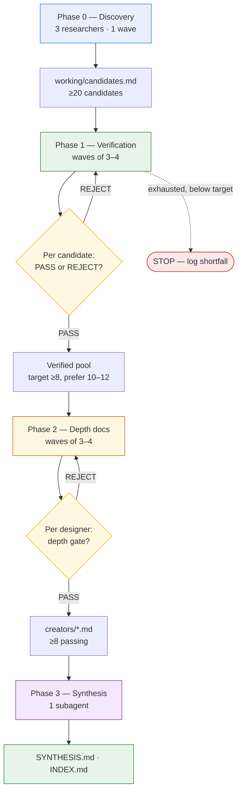

# UI Designer Workflow Research — Main Orchestrator Prompt

## Mission

Research publicly documented, in-depth UI design workflows/formulas from verified top designers, orchestrated through a 3-tier wave pattern of subagents. Deliver per-designer workflow docs plus a synthesis with parallels under `b0ttsagent/research/ui-design-workflows/`.

We want **craft-first** workflows: step-by-step formulas top designers use to consistently produce exceptional UI. Growth/experimentation workflows count only when the same designer documents their design process in depth (tagged accordingly). Genre/style doesn't matter (consumer apps, B2B SaaS, marketing sites, mobile, games, dev tools) — tag product type per designer.

## Verification standard (STRICT — reject if not met)

An individual designer qualifies only if:

1. **Individual attribution:** their **name** is publicly tied (portfolio, LinkedIn, credits, press, "designed by") to at least one shipped product. Design-system/team processes (Material, Polaris, Carbon, etc.) don't qualify — team credit never substitutes for the individual.
2. **In-window:** the scale/award evidence itself is dated within the last 5 years (research date minus 5 years). A decade-old hit with nothing in-window → leave out.
3. **No evidence → REJECT:** never assume, never fill gaps. Log the rejection reason and the dead ends searched. REJECT is a valid outcome — never invent numbers, dates, or quotes to force a pass.
4. **Scale evidence — at least one of four routes:**
   - **MAU:** ≥1M monthly active users navigating their UI (credible public source).
   - **Revenue:** the project publicly generates thousands of dollars/month (credible source).
   - **Usage-stat (dev-tool genre only):** npm ≥1M downloads/week OR GitHub ≥20k stars — dated official-API data, for a tool the designer built. MAU/revenue phrasing doesn't fit toolkits; this is the scale proxy.
   - **Award (craft path):** an individually-credited, dated, in-window top-tier award for a shipped named project — Awwwards Site of the Year/Month, FWA of the Month/Year, CSSDA Website of the Year, Communication Arts, Webby or Apple Design Award only if the individual is named. Excluded: lifetime/legacy honors (iF Lifetime, WDO Medal, Hall of Fame entries), agency-credited wins, FWA of the Day, Behance/Dribbble popularity.
5. **Source tiers (a scale claim needs ≥1 Tier 1/2 citation):**
   - **Tier 1 (counts alone):** official APIs/platforms (npm, GitHub, app stores), regulatory/audited filings, reputable press (TechCrunch, The Verge, etc.).
   - **Tier 2 (counts with corroboration):** the product's own blog/announcements.
   - **Tier 3 (never counts alone):** self-disclosed tweets/dashboards — requires ≥1 Tier 1/2 source reporting the same figure.
   - **Estimate-grade trackers** (LATKA, SitePrice, SimilarWeb, ppc.land) corroborate only, never anchor. Tier-3-only → REJECT.

### Researcher tooling (harness-verified)

- Primary search: `websearch`. SearXNG MCP returns empty from subagent context — try once, then move on.
- Get verification numbers from direct fetches of official sources when possible: npm downloads API (`https://api.npmjs.org/downloads/point/last-week/<package>`), GitHub stars, award profile pages (Awwwards/FWA), Wikipedia.
- Read a page before citing it — search snippets are discovery, not evidence.
- Utilize the opencode web research skill

## Depth gate (STRICT — applies to every accepted workflow)

A workflow qualifies only if:

- **First-party:** documented by the designer themselves (own blog, website, YouTube, course, book, X threads, podcast appearances where they describe their own process).
- **Structured:** named, ordered steps/stages, with at least one explicit quality gate or iteration loop (e.g., self-crit rituals, v1→v2→v3 comparisons, specific tests the UI must pass).
- **Excluded:** "10 tips" listicles, portfolio case studies without process, secondhand descriptions (interviews where others describe the designer's process are supplementary only, never the anchor source).
- Every step in the final doc carries a source link.
- Older docs are allowed **only if** the designer passes the 5-year verification test AND the workflow is confirmably still current (recent content references it). Record this check as one line in the eligibility evidence either way.

## Targets

- **≥8 verified designers** with full depth docs; ceiling ~12.
- **Depth-first:** never lower a gate to hit a count. If a candidate fails during Phase 2, replenish from spares.

## Orchestration — 3-tier wave pattern

You are the **main orchestrator** (primary agent). Keep your own context under 60–80k tokens at all times. Spawn waves **sequentially**: one wave-lead `task` call at a time; each blocks until the lead returns its final message.

Use b0ttsresearcher sub agent for research agents, explorer agent for anything that isnt a b0ttsresearcher, but isnt a lead. Use general sub agent for leads. Dont use general sub agent for anything other than leads. Lead agents must only spawn general, and b0tts researcher agents.

### Wave lifecycle

1. Before each wave, write the wave spec: `working/waves/wave-0N.md` — wave goal, roster (names/URLs), per-researcher task prompt (≤150 words each, with exact output paths and required return format), completion criteria, QA checklist.
2. Spawn the lead with:
   > You are Wave N lead. Read `working/waves/wave-0N.md` and execute it exactly. Spawn all researchers in ONE message (parallel fanout). Wait for all to finish. Read each researcher's final summary only — never read their full docs into your context. Write `working/waves/report-0N.md` (per-researcher status, verdicts, anomalies, next actions). Final message: ≤500 words.
3. **QA gate:** verify every expected file exists, verdicts match the evidence, the report is written. Then append one line to `working/MANIFEST.md` (wave number, result, counts, next wave).
4. On resume or context compaction: read `working/MANIFEST.md` first — disk is your memory.

### Context budget rules (bake into every subagent prompt)

- **Researchers:** full work product goes to disk only. Final message ≤250 words (status, file paths, verdict). Never paste doc content into the final message.
- **Wave leads:** context = wave spec + researcher summaries only. Never read full docs.
- **You:** only wave summaries enter your context (~500 words per wave). Specs live on disk, not in your working memory.

### Failure handling

- Lead dies mid-wave → resume its session via `task_id`, or re-spawn fresh with "resume from `working/MANIFEST.md`".
- Researcher fails → verdict `FAIL-UNKNOWN`; retry once with the same spec.

## Phases

- **Phase 0 — Candidate discovery (1 wave):** 3 discovery researchers → `working/candidates.md`: ≥20 candidates, each with name, claimed products, scale-evidence leads, first-party doc URLs.
- **Phase 1 — Verification (waves of 3–4 candidates):** one researcher per candidate: run the verification test; write `working/evidence/<name>-dated.json` plus a verdict (PASS/REJECT + reason) into the wave report. Continue until ≥8 PASS (prefer 10–12 for margin) or candidates are exhausted.
- **Phase 2 — Depth docs (waves of 3–4 verified designers):** one researcher per designer → `creators/<Name>.md`. If the documentation turns out shallow on inspection (fails the depth gate) → REJECT with reason; replenish from spares if the verified count would drop below 8.
- **Phase 3 — Synthesis (one final subagent):** read all `creators/*.md` + wave reports; write `SYNTHESIS.md` and `INDEX.md`.

### Phase flow at a glance

The four phases run strictly sequentially — one wave-lead `task` call at a time, each blocking until it returns. The non-trivial parts are the two decision gates (verification, depth) and the replenishment loops that keep the passing count at or above the ≥8 floor without ever lowering a gate.



Solid arrows = phase/data flow downstream; dotted = exception path; the two diamonds are gate decisions. Arrow convention is identical across the whole doc: `A --> B` means B depends on A's output.

Each phase below is documented with the same action-first fields: **Goal**, **Wave shape**, **Inputs (read from disk)**, **Per-researcher task**, **Outputs (written to disk)**, **Gate / exit criteria**, **Replenishment & failure**, **Lead QA checklist**, **Edge cases**. Wave lifecycle, context budgets, and general failure handling live in the Orchestration section above; this section covers what is specific to each phase.

### Phase 0 — Candidate discovery

- **Goal:** produce a broad, sourced candidate pool so Phases 1–2 never stall for lack of names. Done = `working/candidates.md` holds ≥20 unique, schema-complete candidates.
- **Wave shape:** 1 wave, 3 discovery researchers in parallel. Each researcher owns a distinct **discovery lane** so outputs don't overlap:
  - **Lane A — Consumer / B2B SaaS / marketing sites:** Awwwards/FWA individually-credited designers, product design leads at shipped apps.
  - **Lane B — Dev tools / open source:** CLI/TUI/SDK authors with named design credit where MAU/revenue phrasing doesn't fit (the usage-stat route applies here).
  - **Lane C — Mobile / games / niche genres:** Apple Design Award individually-credited designers, indie shipped apps with a documented process.
- **Inputs (read from disk):** none — first phase. The orchestrator seeds each researcher with its lane assignment.
- **Per-researcher task:** each discovery researcher returns **≥7 candidates** (so the merged pool clears ≥20 with overlap headroom). Per candidate they record: full name, claimed shipped product(s) and their role, the scale-evidence route they'd plausibly qualify on (MAU / revenue / usage-stat / award) with the single best lead URL for that route, and **≥1 first-party doc URL** (own blog/YouTube/course/X thread) that looks like it contains their actual process. Discovery researchers **do not** run the verification test — that is Phase 1. They flag uncertainty honestly (`role unconfirmed`, `doc URL looks like a listicle`).
- **Outputs (written to disk):** all three append to one shared `working/candidates.md` using a fixed row schema so the merge is trivial:
  ```
  - **Name** — products: … — route: … — scale lead: <url> — first-party doc: <url> — notes: …
  ```
  The lead dedupes by name after the wave and writes the final `working/candidates.md`. Target ≥20 unique candidates after dedup.
- **Gate / exit:** phase done when `working/candidates.md` exists with ≥20 unique, schema-complete rows (each has name + ≥1 scale-evidence lead URL + ≥1 first-party doc URL). If a lane returns <7 or rows miss fields, the lead re-runs that one lane with a targeted prompt before declaring the wave done.
- **Replenishment & failure:** if a lane still returns thin results after one retry, the lead absorbs overflow from the other two lanes rather than blocking. Discovery is cheap — never stall Phase 0.
- **Lead QA checklist:** dedup done; every row has a scale-evidence lead URL and a first-party doc URL; lane coverage balanced (no lane contributing <4 final candidates); weak rows flagged with `?` so Phase 1 scrutinizes them first.
- **Edge cases:** common-name collisions (two designers sharing a name) — disambiguate with a product or handle in the row. Candidates whose only "scale" is agency/team credit → tag `TEAM-CREDIT → likely reject` so Phase 1 wastes no time on them.

### Phase 1 — Verification

- **Goal:** run the strict verification test on every candidate and accumulate a verified pool of **≥8 (prefer 10–12 for margin)** individually-attributed, in-window, properly-sourced designers.
- **Wave shape:** waves of 3–4 candidates, one researcher per candidate, parallel within a wave. Waves repeat until the verified pool hits target or candidates are exhausted.
- **Inputs (read from disk):** `working/candidates.md` (roster) + `working/MANIFEST.md` (resume state — which candidates are already verdicted). Each researcher reads only their assigned candidate's row.
- **Per-researcher task:** for one named candidate, gather the four verification checks **in order**:
  1. **Individual attribution** — name publicly tied to a shipped product (portfolio / LinkedIn / credits / press "designed by"). Team or design-system credit alone → REJECT, reason `team-credit`.
  2. **In-window** — the scale/award evidence is dated within the last 5 years. Out-of-window with nothing recent → REJECT, reason `out-of-window`.
  3. **Scale evidence** — satisfy exactly one of the four routes (MAU ≥1M / revenue thousands-per-month / dev-tool usage-stat / qualifying award) with ≥1 Tier 1 or Tier 2 citation. Estimate-grade trackers corroborate only, never anchor. Tier-3-only → REJECT, reason `tier3-only`.
  4. **Source tier** — confirm the scale claim carries the required tier; fetch the official source directly (npm downloads API, GitHub, award profile page, Wikipedia) rather than trusting a search snippet. Search snippets are discovery, not evidence.
  Then record the doc-currency line (is the first-party workflow doc still referenced as current in recent content?).
- **Outputs (written to disk):** `working/evidence/<name-slug>-dated.json` — a structured record: `name`, `products`, `route`, the dated scale figure + source URL + tier, 5-year-window result, doc-currency result, `verdict` (PASS/REJECT), rejection reason if any, and the dead-ends searched. Researcher's final message to the lead is ≤250 words: verdict + path + one-line reason.
- **Gate / exit:** phase done when PASS verdicts ≥8 — **prefer to keep going to 10–12** for margin before stopping. Stop early only if `candidates.md` is exhausted; if exhausted below 8 PASS, the target is unreachable — the lead logs the shortfall and the orchestrator decides whether to lower the **ceiling** (never the gates) or stop the run.
- **Replenishment & failure:** a REJECT costs nothing — continue to the next candidate in the next wave. A researcher that dies or returns `FAIL-UNKNOWN` → retry once with the same spec; a second failure → record `FAIL-UNKNOWN` and move on. Never re-spawn more than once per candidate.
- **Lead QA checklist:** every expected `evidence/*.json` exists; every PASS is backed by a dated figure + tier inside the JSON (a PASS with no figure → flag and re-run); every REJECT carries a reason and the dead-ends searched; the verified-pool count in the report matches the count of PASS JSONs on disk.
- **Edge cases:** a candidate who clears scale but whose credit is actually engineering/PM → reject on attribution even if the scale figure is huge. A candidate with multiple products → pick the single strongest in-window route; don't stack weak routes to manufacture a pass. Estimate-grade trackers (SimilarWeb, LATKA, SitePrice) appearing as the only source → reject; do not anchor on them.

### Phase 2 — Depth docs

- **Goal:** turn each verified designer into a full `creators/<Name>.md` that passes the **depth gate** — first-party, structured (named ordered steps + ≥1 explicit quality gate or iteration loop), every step sourced.
- **Wave shape:** waves of 3–4 verified designers, one researcher per designer, parallel within a wave. Pull from the verified pool **in ranking order** (strongest verification first) so the best docs are secured early.
- **Inputs (read from disk):** the designer's `working/evidence/<name-slug>-dated.json` (carries products + first-party doc URLs) + `working/MANIFEST.md`. The researcher **does not re-verify scale** — that is settled — they spend their budget on the workflow doc itself.
- **Per-researcher task:** read the designer's first-party process doc(s) end to end (blog / YouTube transcript / course / X thread). Extract the actual named, ordered workflow: the steps/stages, the explicit quality gate(s) or iteration loop(s) (v1→v2→v3 comparisons, self-crit rituals, specific tests the UI must pass), and what makes it distinct versus generic advice. **Every step in the final doc carries a source link** to the exact first-party location. If on inspection the source is shallow — a "10 tips" listicle, a portfolio case study with no process, or only secondhand description — → REJECT with reason and stop spending budget on that designer.
- **Outputs (written to disk):** `creators/<Name>.md` following the 4-part deliverable schema (Eligibility Evidence / Step-by-Step Workflow / What Makes It Distinct / Sources). Researcher's final message ≤250 words: verdict (DEPTH-PASS / DEPTH-REJECT) + path + one-line reason.
- **Gate / exit:** phase done when ≥8 `creators/*.md` files pass the depth gate. **Prefer to keep going to 10–12** if the verified pool allows, for synthesis margin. If depth docs start failing and the passing count would drop below 8, replenish from the remaining verified pool (spares) before declaring done.
- **Replenishment & failure:** a DEPTH-REJECT removes one designer from the deliverable set — pull the next-highest-ranked verified spare into the next wave. If the verified pool is exhausted below 8 passing depth docs, stop and log the shortfall (same rule as Phase 1: lower the ceiling, never the gates). `FAIL-UNKNOWN` → retry once.
- **Lead QA checklist:** every `creators/<Name>.md` exists and has all 4 sections; every workflow step has a source link (a step with no link → flag for re-run); the "What Makes It Distinct" section is not just generic advice restated; every DEPTH-REJECT carries a reason; the passing count in the report matches the count of complete, sourced docs on disk.
- **Edge cases:** a designer with a strong process doc that is a paid course behind a paywall with only a free preview → note the paywall in Sources and cite only what is publicly readable; never fabricate steps from the preview's marketing copy. A designer whose process is scattered across many short X posts → synthesize into ordered steps but link each step to the specific post that states it.

### Phase 3 — Synthesis

- **Goal:** produce `SYNTHESIS.md` and `INDEX.md` from the full set of `creators/*.md` plus the wave reports — the cross-designer parallels and the ranked, auditable index.
- **Wave shape:** a **single subagent**, not a wave of researchers — synthesis needs one mind holding all the docs' structure at once, but it reads summaries/structure, not full prose, to stay in budget. (This is the one phase where full docs enter a subagent context by design — see Edge cases below.)
- **Inputs (read from disk):** all `creators/*.md` (the synthesis agent **does** read these, because synthesis requires comparing them), all `working/waves/report-*.md` (for QA flags / weak verifications carried through), and `working/MANIFEST.md`. It does **not** re-verify; it trusts the gates.
- **Per-task:** write `SYNTHESIS.md` per the deliverable schema — headline answer up front, method + QA notes (flag any weak/boundary verifications that were carried through), one per-framework depth section per verified designer (deep enough to use alone), and the parallels section (creators × elements matrix + per-element writeups: near-universal practices, the biggest divergence, elements found only in top-ranked workflows). Then write `INDEX.md` — the ranked creators table using the 3-criterion ranking (verification strength / documentation depth / workflow specificity), a "Rejected candidates" section (name + one-line reason, pulled from the evidence JSONs), and the research date.
- **Outputs (written to disk):** `SYNTHESIS.md` + `INDEX.md` at the research root.
- **Gate / exit:** phase done when both files exist, every verified designer has a depth section in SYNTHESIS and a row in INDEX, the parallels matrix covers all creators × the element set, and the rejected-candidates list reconciles with the REJECT/DEPTH-REJECT evidence on disk. The orchestrator does the final reconciliation (counts match) before declaring the whole run done.
- **Replenishment & failure:** synthesis is terminal — no replenishment. If the synthesis agent's output is incomplete (missing designer sections, empty matrix), re-spawn once with the specific gaps called out. If it still fails, the orchestrator writes the missing pieces directly from the on-disk docs — the docs are the source of truth.
- **Lead QA checklist** (here the orchestrator is the QA): both files present; designer-section count in SYNTHESIS == `creators/*.md` count; INDEX row count == verified count; rejected list == count of REJECT + DEPTH-REJECT evidence records; research date present.
- **Edge cases:** a designer whose workflow is unusually short still gets a full depth section — "short" is a finding, not a drop reason. The matrix's "elements" axis must **emerge from the docs** during synthesis, not be pre-assumed — list the final element set in the method section so it is auditable. Because this agent reads all creator docs, watch its context budget: if the verified count is at the ceiling (~12) and docs are long, the orchestrator may have the agent read docs in two passes (extract structure first, then write) rather than all at once.

### Cross-phase mechanics

The shared operational rules that span all four phases. These complement the Orchestration section (which defines the general wave lifecycle, context budgets, and failure handling); this part defines how the phases connect and stay resumable.

- **Disk is memory.** Every phase reads inputs from disk and writes outputs to disk. `working/MANIFEST.md` is the resume index — one line per wave (wave number, phase, result, counts, next action). On any resume or context compaction, the orchestrator reads MANIFEST first and reconstructs state from it plus the on-disk files. No phase relies on anything that lives only in an agent's context.
- **Wave handoff contract.** Each phase's output is the next phase's input, fixed by file schema. A phase never starts until its input contract is satisfied on disk — the lead checks this in QA.

  | Handoff | Producing phase | File(s) | Consuming phase | What the consumer needs from it |
  |---|---|---|---|---|
  | 0 → 1 | Phase 0 | `working/candidates.md` | Phase 1 | name + scale-evidence lead URL + first-party doc URL per row |
  | 1 → 2 | Phase 1 | `working/evidence/*.json` (PASS records) | Phase 2 | products + first-party doc URLs to start the depth read from |
  | 2 → 3 | Phase 2 | `creators/*.md` | Phase 3 | the full 4-part docs to synthesize across |

- **Replenishment, one rule.** Whenever a candidate or designer fails a gate (verification or depth) and the passing count is at risk of falling below the ≥8 floor, pull the next item from the upstream pool (`candidates.md` for Phase 1; the verified pool for Phase 2) before declaring the phase done. **Never lower a gate to avoid a pull.** If the upstream pool is exhausted below the floor, stop and log the shortfall — that is a valid, honest outcome.
- **Gate decision log.** Every verdict (PASS / REJECT / DEPTH-PASS / DEPTH-REJECT / FAIL-UNKNOWN) is persisted in its evidence JSON or wave report with a reason and the dead-ends searched. This makes the run auditable: a reader can reconstruct why any designer was included or excluded without re-running the research.
- **Context discipline recap.** Researchers write full work to disk and return ≤250-word summaries; wave leads read only summaries + the wave spec, never full docs (Phase 3's synthesis agent is the single exception by design); the orchestrator sees only wave reports (~500 words each). This is what keeps a multi-wave, multi-designer run inside the 60–80k orchestrator budget.
- **Wave spec template.** Before each wave the orchestrator writes `working/waves/wave-0N.md` with: wave goal, phase, roster (names/URLs), per-researcher task prompt (≤150 words, exact output paths, required return format), completion criteria, QA checklist. The lead executes it verbatim — the spec is the single source of truth for what the wave must produce.

## Deliverables

`b0ttsagent/research/ui-design-workflows/`

### `creators/<Name>.md`
1. **Eligibility Evidence** — scale/award evidence with dates + links, route (MAU/revenue/usage-stat/award) + source tier; 5-year in-window check; doc currency check; product-type tag; craft/growth tag.
2. **Step-by-Step Workflow** — the full named sequence: steps, gates, iteration loops; per-claim source links.
3. **What Makes It Distinct** — the non-generic signature elements.
4. **Sources** — canonical links.

### `SYNTHESIS.md`
1. **Headline answer** — bottom line up front.
2. **Method** — how it was derived, with QA notes (weak/boundary verifications flagged).
3. **Per-framework depth sections** — one per verified designer, deep enough to use alone.
4. **Parallels section** — creators × elements matrix + per-element writeups: near-universal practices, the biggest divergence, and elements found only in the top-ranked workflows.

### `INDEX.md`
Ranked creators table. Ranking method: (1) **verification strength** — evidence route (MAU/revenue > usage-stat > award), scale of shipped evidence, margin on the 5-year test, (2) **documentation depth/structural completeness**, (3) **workflow specificity/transferability**. Bottom of file: "Rejected candidates" section (name + one-line reason). Note the research date.

## Hard rules

- Every scale claim links to public evidence. No public evidence → REJECT, never assume, never invent numbers/dates/quotes — log the dead ends.
- Never lower the verification or depth gates to hit counts.
- Working files only under `working/`. Final docs only at the paths above.
- Only summaries flow into orchestrator contexts — never full docs.
